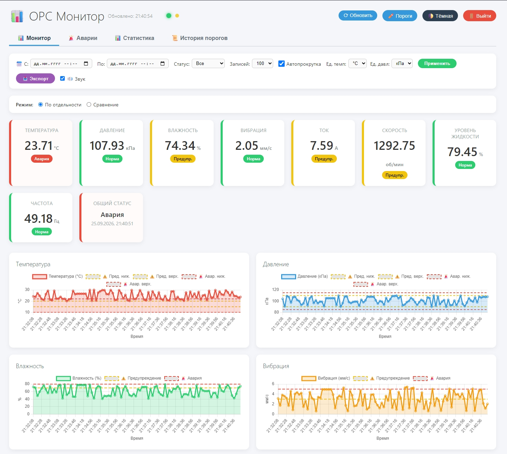
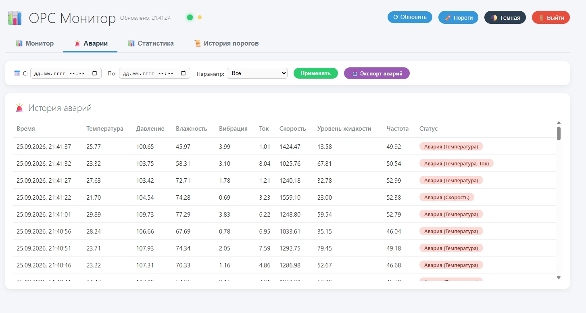
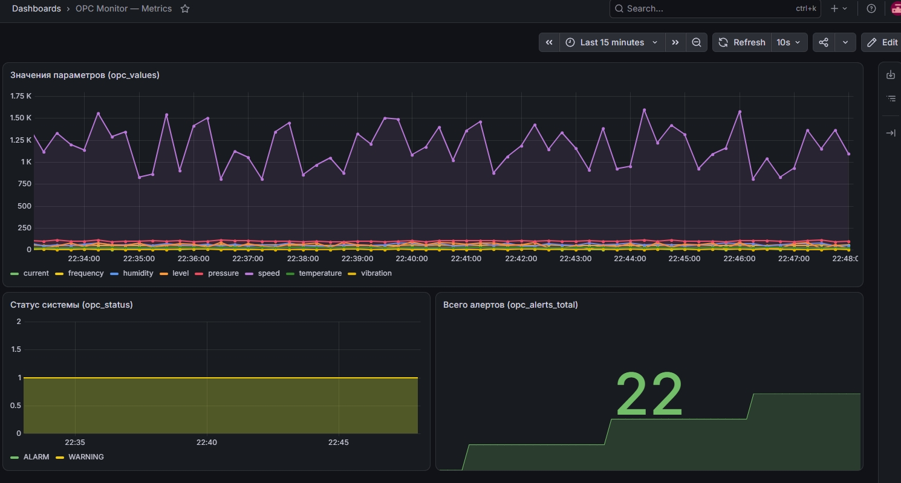
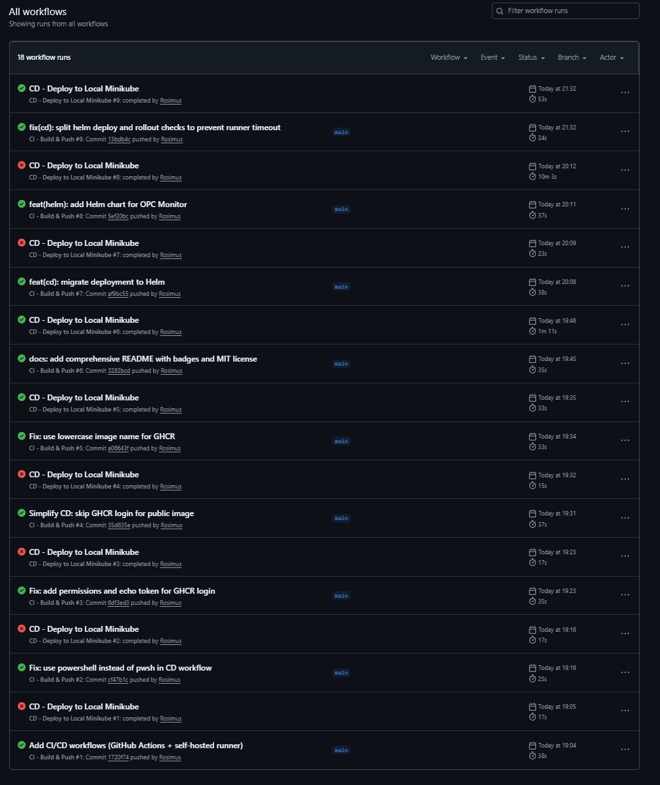

# OPC Monitor

[](https://github.com/Rosimus/opc-monitor/actions/workflows/ci.yml)
[](https://github.com/Rosimus/opc-monitor/actions/workflows/cd.yml)
[](https://github.com/Rosimus/opc-monitor/pkgs/container/opc-monitor)
[](https://www.python.org/downloads/)
[](https://kubernetes.io/)
[](https://helm.sh/)
[](#-тестирование)
[](https://opensource.org/licenses/MIT)

Система мониторинга промышленного оборудования на OPC UA с веб-интерфейсом, алертами, аналитикой и полным CI/CD pipeline.

## ✨ Возможности

- 📊 **Real-time мониторинг** 8 параметров (температура, давление, влажность, вибрация, ток, скорость, уровень, частота)
- 🎬 **Реалистичный симулятор PLC** — random walk, mean reversion, суточные колебания, случайные и каскадные аварии
- 🚨 **Многоуровневые алерты** (Warning / Alarm) с Email и Telegram уведомлениями
- 📈 **Графики в реальном времени** — Chart.js с пороговыми линиями
- 🔐 **JWT-аутентификация** веб-интерфейса
- 📥 **Экспорт данных** в CSV и Excel
- 🎯 **REST API** с автогенерируемой документацией (Swagger)
- 📉 **Метрики Prometheus** + **Grafana dashboard as code** (5 панелей, provisioning через ConfigMap)
- 🔔 **Alertmanager** с правилами алертов (`ServiceDown`, `HighAlarmRate`, `NoMeasurements`, `HighAPILatency`)
- 🐳 **Docker-образ** с автоматической сборкой
- ☸️ **Kubernetes-деплой** через kubectl / Helm
- ⛵ **Helm-чарт** с параметризацией под staging и prod
- 🌩️ **Terraform** — IaC для Yandex Cloud (k3s, managed PostgreSQL)
- 🔄 **CI/CD** через GitHub Actions с self-hosted runner
- ✅ **41 тест** (29 unit + 12 integration) в CI pipeline
- 📦 **GHCR** — автоматическая загрузка образов
- 🛡️ **Security Hardened** — non-root, security headers, rate limiting, Trivy scan

## 🏗️ Архитектура

Проект — это **распределённая система из 8 контейнеров**, объединённых общей сетью и слоем хранения. Каждый сервис выполняет одну функцию; взаимодействие идёт через базу данных, Redis-кэш и HTTP-протоколы.

```
┌──────────────────────────────────────────────────────────┐
│                    OPC UA Server (PLC)                   │
│                    opc.tcp://server:4840                 │
└───────────────────────────┬──────────────────────────────┘
                            │ OPC UA (TCP)
                            ▼
┌──────────────────────────────────────────────────────────┐
│              OPC Client (Python + opcua)                 │
│  • Сбор данных каждые 5 секунд                           │
│  • Проверка порогов                                      │
│  • Отправка алертов (Email, Telegram)                    │
│  • Метрики Prometheus на :8001                           │
└───────────────────────────┬──────────────────────────────┘
                            │ SQLAlchemy + Redis
                            ▼
┌──────────────────────────────────────────────────────────┐
│            PostgreSQL 15 + Redis Cache                   │
└───────────────────────────┬──────────────────────────────┘
                            │
                            ▼
┌──────────────────────────────────────────────────────────┐
│         Web App (Flask + Gunicorn)                       │
│  • REST API с JWT-аутентификацией                        │
│  • Web UI (Chart.js, dark/light тема)                    │
│  • Security headers (Talisman) + Rate limiting           │
│  • Метрики Prometheus на :5000/metrics                   │
└───────────────────────────┬──────────────────────────────┘
                            │
                            ▼
┌──────────────────────────────────────────────────────────┐
│           Prometheus + Alertmanager + Grafana            │
│           Мониторинг и алертинг системы                  │
└──────────────────────────────────────────────────────────┘
```

## 🛠️ Стек технологий

| Категория | Технологии |
|-----------|------------|
| **Backend** | Python 3.11, Flask, SQLAlchemy, Gunicorn, structlog |
| **Frontend** | Vanilla JS, Chart.js, Socket.IO client |
| **База данных** | PostgreSQL 15, Redis 7 (кэш) |
| **Аутентификация** | JWT (flask-jwt-extended) |
| **Безопасность** | Flask-Talisman, Flask-Limiter, Trivy |
| **Оркестрация** | Kubernetes (k3s / Minikube), Helm 3 |
| **CI/CD** | GitHub Actions, GHCR, self-hosted runner |
| **Мониторинг** | Prometheus, Alertmanager, Grafana (provisioning as code) |
| **Контейнеризация** | Docker, Docker Compose |
| **IaC** | Terraform (Yandex Cloud) |
| **Тесты** | pytest, pytest-cov, pytest-mock |

## 📸 Скриншоты

### 📊 Real-time Dashboard



*Real-time мониторинг 8 параметров с карточками статусов, графиками и пороговыми линиями*

### 🚨 История аварий



*Полная история аварий с фильтрацией по времени, параметрам и статусу*

### 📈 Grafana Dashboard



*Provisioned дашборд с 5 панелями: значения параметров, статус системы, алерты, RPS и латентность API*

### ✅ CI/CD Pipeline



*GitHub Actions: тесты → сборка → Trivy scan → деплой через Helm*

## 🚀 Быстрый старт

### Предварительные требования

- **Windows 10/11** с WSL2 (или Linux/macOS)
- **Docker Desktop** 4.20+
- **Minikube** 1.30+
- **kubectl** 1.27+
- **Helm** 3.12+

### Запуск через Docker Compose

```bash
git clone https://github.com/Rosimus/opc-monitor.git
cd opc-monitor
copy .env.example .env
docker-compose up -d
```

**Доступ**: http://localhost:5000

### Запуск в Kubernetes через Helm (рекомендуется)

```bash
minikube start --driver=docker --memory=4096 --cpus=4
docker build -t opc-monitor:latest .
minikube image load opc-monitor:latest

helm install opc-monitor ./helm/opc-monitor \
  --namespace opc-monitor \
  --create-namespace \
  --values ./helm/opc-monitor/values-prod.yaml

kubectl port-forward -n opc-monitor service/web 5000:5000
kubectl port-forward -n opc-monitor service/grafana 3000:3000
kubectl port-forward -n opc-monitor service/prometheus 9090:9090
kubectl port-forward -n opc-monitor service/alertmanager 9093:9093
```

**Доступ**:
- Web UI: http://localhost:5000
- Grafana: http://localhost:3000 (admin / admin)
- Prometheus: http://localhost:9090
- Alertmanager: http://localhost:9093

## 🔄 CI/CD Pipeline

Проект использует **полностью автоматизированный CI/CD** через GitHub Actions.

### CI — Test, Build & Push

При каждом push в `main`:
1. ✅ **Run Tests** — 41 тест (29 unit + 12 integration) + coverage report
2. ✅ Автоматическая сборка Docker-образа
3. ✅ Загрузка в GitHub Container Registry (GHCR)
4. ✅ **Trivy scan** — проверка на уязвимости (CRITICAL/HIGH)
5. ✅ Теги: `latest`, `sha-<commit>`, `<branch>`

### CD — Deploy to Minikube

После успешного CI:
1. ✅ Self-hosted runner получает задачу
2. ✅ Скачивает образ из GHCR
3. ✅ Загружает в Minikube
4. ✅ Выполняет `helm upgrade --install` (атомарно)
5. ✅ Проверяет готовность через `kubectl rollout status`
6. ✅ Публикует summary с состоянием подов

**Время от `git push` до работающего приложения: ~60 секунд** ⚡

### Откат

```bash
helm history opc-monitor -n opc-monitor
helm rollback opc-monitor -n opc-monitor
```

## 🚀 Эксплуатация

### Runbook

Инструкция для on-call инженера: диагностика алертов, типовые операции, восстановление после сбоев — в **[docs/RUNBOOK.md](docs/RUNBOOK.md)**.

### SLO / SLI

| Метрика | SLI | SLO |
|---------|-----|-----|
| Доступность Web UI | `up{job="opc-monitor"}` | ≥ 99% в месяц |
| Доступность OPC Client | `up{job="opc-client"}` | ≥ 99% в месяц |
| Латентность API (p95) | `histogram_quantile(0.95, api_latency_seconds_bucket)` | < 500 ms |
| Задержка сбора данных | `rate(opc_values[5m])` | > 0 |
| RTO | — | ≤ 5 минут (helm rollback) |
| RPO | — | ≤ 24 часа (pg_dump) |

**Error Budget:** 1% недоступности в месяц = ~7.2 часа.

### Алерты

Правила алертов описаны в `monitoring/alerts.yml`. Prometheus отправляет их в Alertmanager, который логирует в stdout (receiver `default`).

| Алерт | Severity | Условие |
|-------|----------|---------|
| `ServiceDown` | critical | Сервис недоступен > 1 мин |
| `HighAlarmRate` | warning | > 0.5 алертов/сек за 5 мин |
| `NoMeasurements` | warning | Нет измерений > 3 мин |
| `HighAPILatency` | warning | p95 API > 1 сек за 3 мин |

### Типовые операции

```bash
# Проверить статус
kubectl get pods -n opc-monitor
kubectl get pvc -n opc-monitor

# Перезапустить сервис (замени <service> на web, client, server, grafana, prometheus, alertmanager)
kubectl rollout restart deployment/web -n opc-monitor

# Откатить релиз
helm rollback opc-monitor -n opc-monitor

# Посмотреть логи
kubectl logs -n opc-monitor deployment/web --tail=100
```

Полный список — в **[docs/RUNBOOK.md](docs/RUNBOOK.md)**.

## 🔐 Безопасность

### Уровень приложения
- ✅ **JWT-аутентификация** — flask-jwt-extended
- ✅ **Rate limiting** — защита от брутфорса (5 попыток/мин на login)
- ✅ **Security Headers** — Flask-Talisman (CSP, HSTS, X-Frame-Options, X-Content-Type-Options)
- ✅ **Non-root user** в Docker
- ✅ **Параметризованные SQL-запросы** — SQLAlchemy ORM

### Уровень CI/CD
- ✅ **Trivy** — сканирование образа на уязвимости (CRITICAL/HIGH)
- ✅ **GitHub Secrets** для чувствительных данных
- ✅ **GITHUB_TOKEN** с минимальными правами
- ✅ **pytest + coverage** — тесты как часть pipeline

### Уровень инфраструктуры
- ✅ **securityContext fsGroup: 472** для Grafana
- ✅ **Kubernetes Secrets** для хранения паролей
- ✅ **Security Groups** в Yandex Cloud

### Соответствие стандартам
- ✅ **OWASP Top 10** — A01, A02, A03, A05, A07
- ✅ **CIS Docker Benchmark** — non-root user, healthcheck

### Известные ограничения (для пет-проекта)

- Симулятор PLC не использует TLS/шифрование OPC UA — это допустимо для демонстрации. В продакшене требуется настроить сертификаты и security policy.
- Alertmanager использует receiver `default` (логирует в stdout). Telegram-интеграция подготовлена, но требует реальных `bot_token` и `chat_id`.

## 🔑 Управление секретами

### Текущий подход (для демо)

Секреты хранятся в `helm/opc-monitor/values.yaml` в открытом виде. Значения — placeholder'ы, которые нужно заменить при первом деплое.

**Почему так:** для пет-проекта это упрощает воспроизведение. Реальные секреты не попадают в Git благодаря `.gitignore`.

### Продакшен-подходы

В продакшене секреты не хранятся в values-файлах. Используются:

| Инструмент | Как работает |
|------------|--------------|
| **External Secrets Operator** | Синхронизирует секреты из внешнего хранилища (Vault, Yandex Lockbox, AWS Secrets Manager) в Kubernetes Secret |
| **Sealed Secrets** | Секреты шифруются публичным ключом и коммитятся в Git; расшифровываются только контроллером в кластере |
| **SOPS + age/KMS** | Шифрование файлов values; расшифровка при деплое через CI или ArgoCD |
| **HashiCorp Vault + Agent Injector** | Секреты инжектятся в поды напрямую из Vault |

**Пример с External Secrets Operator:**

```yaml
apiVersion: external-secrets.io/v1beta1
kind: ExternalSecret
metadata:
  name: opc-secrets
  namespace: opc-monitor
spec:
  refreshInterval: 1h
  secretStoreRef:
    name: yandex-lockbox
    kind: ClusterSecretStore
  target:
    name: opc-secrets
  data:
    - secretKey: POSTGRES_PASSWORD
      remoteRef:
        key: opc-monitor-secrets
        property: postgres-password
    - secretKey: JWT_SECRET_KEY
      remoteRef:
        key: opc-monitor-secrets
        property: jwt-secret
```

**Что нужно для перехода на продакшен:**

1. Заменить `values.yaml` с плейсхолдерами на `values.yaml.example`.
2. В CI/CD передавать секреты через GitHub Secrets.
3. Установить External Secrets Operator + ClusterSecretStore.
4. Создать `ExternalSecret` манифест (пример выше).

## 🧪 Тестирование

```bash
pip install -r requirements.txt
pytest tests/ -v
pytest tests/ -v --cov=. --cov-report=term-missing
```

**41 тест** покрывают:

### Unit-тесты (`tests/test_utils.py`)
- `get_param_status` — двусторонний и односторонний контроль, edge cases
- `parse_datetime` — 5 сценариев парсинга
- Конвертеры температуры и давления
- Лейблы единиц измерения

### Integration-тесты (`tests/test_api.py`)
- Healthcheck (`/health`)
- Авторизация (`/api/auth/login`) — успех и провал
- JWT-защита (`/api/latest`, `/api/history`, `/api/params`)
- Metrics (`/metrics`)
- Root (`/`)

## 📁 Структура проекта

```
opc-monitor/
├── .github/workflows/           # CI/CD
│   ├── ci.yml                   # tests + build + Trivy + push
│   └── cd.yml                   # deploy через Helm
├── helm/opc-monitor/            # Helm-чарт
│   ├── Chart.yaml
│   ├── values.yaml
│   ├── values-staging.yaml
│   ├── values-prod.yaml
│   ├── dashboards/
│   │   └── opc-monitor.json
│   └── templates/
├── k8s/                         # Kubernetes-манифесты (kubectl)
├── monitoring/
│   ├── prometheus.yml
│   ├── alerts.yml               # правила алертов
│   ├── alertmanager.yml         # конфиг Alertmanager
│   ├── grafana-datasources.yml
│   ├── grafana-dashboards.yml
│   └── grafana-dashboard.json
├── terraform/                   # IaC для Yandex Cloud
├── tests/
│   ├── __init__.py
│   ├── conftest.py              # pytest-фикстуры
│   ├── test_utils.py            # unit-тесты
│   └── test_api.py              # integration-тесты
├── docs/
│   ├── RUNBOOK.md               # Инструкция для on-call
│   └── screenshots/
├── templates/index.html
├── client.py                    # OPC UA клиент
├── server.py                    # OPC UA симулятор (PLCSimulator)
├── web_app.py                   # Flask приложение
├── db.py                        # SQLAlchemy + Redis
├── utils.py
├── config.yaml
├── Dockerfile
├── docker-compose.yml
├── requirements.txt
├── pytest.ini
└── README.md
```

## 🌩️ Infrastructure as Code (Terraform)

Полная Terraform-конфигурация для развёртывания в Yandex Cloud:

| Ресурс | Описание |
|--------|----------|
| **VPC Network** | Сеть с публичной и приватными подсетями |
| **NAT Gateway** | Интернет-доступ для приватных подсетей |
| **Security Group** | Правила firewall для Kubernetes |
| **k3s Master** | VM с k3s control-plane |
| **k3s Workers ×2** | VM с k3s агентами в разных зонах |
| **Managed PostgreSQL** | Кластер БД (s2.micro, 20 GB SSD) |

```bash
cd terraform
cp terraform.tfvars.example terraform.tfvars
# Заполнить: yc_token, yc_cloud_id, yc_folder_id, ssh_public_key

terraform init
terraform validate
terraform plan
terraform apply
terraform destroy
```

## 📊 API Endpoints

| Метод | Endpoint | Описание | Rate Limit |
|-------|----------|----------|------------|
| `POST` | `/api/auth/login` | Получить JWT-токен | 5/min |
| `POST` | `/api/auth/refresh` | Обновить токен | 200/min |
| `GET` | `/api/params` | Список параметров | 200/min |
| `GET` | `/api/latest` | Последнее измерение | 200/min |
| `GET` | `/api/history` | История измерений | 200/min |
| `GET` | `/api/alarms` | История аварий | 200/min |
| `GET` | `/api/stats` | Статистика | 200/min |
| `GET` | `/api/thresholds` | Текущие пороги | 200/min |
| `POST` | `/api/thresholds/update` | Обновить пороги | 200/min |
| `GET` | `/api/export` | Экспорт данных (CSV) | 200/min |
| `GET` | `/health` | Health check | — |
| `GET` | `/metrics` | Prometheus метрики | — |

Полная документация: http://localhost:5000/api/docs

## 📝 Лицензия

MIT. См. [LICENSE](LICENSE).

## 👤 Автор

**Rosimus**

- GitHub: [@Rosimus](https://github.com/Rosimus)
- Email: rosimus854@gmail.com

---

⭐ Если проект был полезен — поставьте звезду!