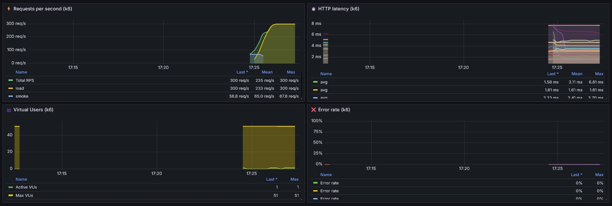

# OPC Monitor

[](https://github.com/Rosimus/opc-monitor/actions/workflows/ci.yml)
[](https://github.com/Rosimus/opc-monitor/actions/workflows/cd.yml)
[](https://github.com/Rosimus/opc-monitor/actions/workflows/codeql.yml)
[](https://codecov.io/gh/Rosimus/opc-monitor)
[](https://github.com/Rosimus/opc-monitor/pkgs/container/opc-monitor)
[](https://www.python.org/downloads/)
[](https://kubernetes.io/)
[](https://helm.sh/)
[](https://argo-cd.readthedocs.io/)
[](https://opcfoundation.org/about/opc-technologies/opc-ua/)
[](#-testing)
[](SECURITY.md)
[](https://opensource.org/licenses/MIT)

**🇬🇧 English** | [🇷🇺 Русская версия](docs/README.ru.md)

> **TL;DR** — Real-time monitoring of industrial equipment over OPC UA: 8 parameters, web dashboard with charts and alerts, full observability stack (Prometheus + Grafana + Loki + Jaeger), CI/CD via GitHub Actions with a self-hosted runner, GitOps via ArgoCD. Python + Flask + PostgreSQL + Redis. **Production-grade reliability:** OPC UA `Basic256Sha256_SignAndEncrypt` with mutual X.509, IEC 62541-100 Nameplate/DeviceHealth, IEC 62443 microsegmentation (17 NetworkPolicies), CloudNativePG 3-replica PostgreSQL with automatic failover (~5 s), Spotahome Redis Sentinel (3 redis + 3 sentinel, failover ~10 s), client liveness on heartbeat. 9 containers, 78 tests, 75% unit coverage, HPA autoscaling 2–5 replicas, VPA in `Off` mode, k6 load-tested at 256 RPS with p95 = 4 ms.

## 📋 Table of Contents

- [Features](#-features)
- [Architecture](#️-architecture)
- [Tech Stack](#️-tech-stack)
- [Screenshots](#-screenshots)
- [Quick Start](#-quick-start)
- [Local Development in Minikube](#-local-development-in-minikube)
- [CI/CD Pipeline](#-cicd-pipeline)
- [Observability](#-observability)
- [Operations](#-operations)
- [Security](#-security)
- [Secrets Management](#-secrets-management)
- [Testing](#-testing)
- [Project Structure](#-project-structure)
- [Infrastructure as Code](#️-infrastructure-as-code-terraform)
- [API Endpoints](#-api-endpoints)
- [Architecture Decision Records](#-architecture-decision-records)
- [Roadmap](#️-roadmap)
- [Lessons Learned](#-lessons-learned)
- [License](#-license)

## ✨ Features

### Application
- 📊 **Real-time monitoring** of 8 parameters (temperature, pressure, humidity, vibration, current, speed, level, frequency)
- 🎬 **Realistic PLC simulator** — random walk, mean reversion, daily cycles, random and cascade failures
- 🚨 **Multi-level alerts** (Warning / Alarm) with Email and Telegram notifications
- 📈 **Real-time charts** — Chart.js with threshold lines
- 🔐 **JWT authentication** for the web UI
- 📥 **Data export** to CSV and Excel
- 🎯 **REST API** with auto-generated documentation (Swagger)

### OPC UA Standard Compliance
- 🔒 **OPC UA SignAndEncrypt** — `Basic256Sha256_SignAndEncrypt` policy with mutual X.509 authentication and OPC UA user credentials
- 🏷️ **IEC 62541-100 Nameplate** — Manufacturer, Model, SerialNumber, HardwareRevision, SoftwareRevision, DeviceRevision as standard properties
- 🩺 **IEC 62541-100 DeviceHealth** — Int32 enumeration (NORMAL / FAILURE / CHECK_FUNCTION / OFF_SPEC / MAINTENANCE_REQUIRED), updated on each cycle

### Observability
- 📉 **Metrics:** Prometheus + Grafana as code (5 panels)
- 🔔 **Alerts:** Alertmanager with 4 rules
- 📋 **Logs:** Loki + Promtail (collected from all pods)
- 🔍 **Traces:** OpenTelemetry + Jaeger (distributed tracing)
- 🔗 **Correlation:** `trace_id` in logs and `X-Trace-Id` header in every HTTP response + one-click navigation Loki ↔ Jaeger

### Reliability & HA
- 🗄️ **PostgreSQL HA** — CloudNativePG 3-replica cluster (1 primary + 2 replica), automatic failover ~5 s, PITR-ready (WAL archiving)
- 🔴 **Redis Sentinel** — Spotahome operator with 3 redis + 3 sentinel pods; automatic master election, client-side re-resolution via `redis.sentinel.Sentinel`
- 🩺 **Client liveness on heartbeat** — detects a hung OPC read-loop, not just an open metrics port
- 🛡️ **IEC 62443 microsegmentation** — default-deny Ingress + Egress with 17 per-service NetworkPolicies
- 📈 **HPA** — CPU-based autoscaling for the web tier (2–5 replicas in production)
- 📐 **VPA in `Off` mode** — continuous right-sizing recommendations for all workloads
- ⚡ **k6 load tested** — 256 RPS sustained, p95 = 4 ms, HPA scaled 2 → 4

### DevOps
- 🐳 **Docker image** with multi-stage build and non-root user
- ☸️ **Kubernetes** via kubectl / Helm
- ⛵ **Helm chart** parameterized for staging/prod
- 🔑 **Secrets management** via GitHub Secrets + `values-secrets.yaml` + `certs-secrets.yaml`
- 🌩️ **Terraform** — IaC for Yandex Cloud (k3s, managed PostgreSQL)
- 🔄 **CI/CD** via GitHub Actions with a self-hosted runner
- 🔀 **ArgoCD** — GitOps approach (pull-based deployment)
- ✅ **78 tests** (29 unit + 12 integration API + 37 integration DB) + Codecov, coverage threshold 70%
- 📦 **GHCR** — automatic image publishing
- 🛡️ **Security Hardened** — strict CSP (no `unsafe-inline` in `script-src`), full audit (SAST/SCA/JWT/ZAP/K8s/Docker/Terraform), 0 CVEs, 0 findings from Bandit / Hadolint / CodeQL

## 🏗️ Architecture

The project is a **distributed system of 9+ containers** connected by a shared network and storage layer. Each service performs a single function.

```
┌──────────────────────────────────────────────────────────┐
│                  OPC UA Server (PLC Simulator)           │
│  • 8 parameters (random walk + mean reversion + alarms)  │
│  • IEC 62541-100: Nameplate + DeviceHealth               │
│  • SignAndEncrypt (Basic256Sha256) + user auth           │
│  • advertise=opc.tcp://0.0.0.0:4840                      │
└───────────────────────────┬──────────────────────────────┘
                            │ OPC UA (TCP, TLS)
                            ▼
┌──────────────────────────────────────────────────────────┐
│              OPC Client (Python + opcua)                 │
│  • Collects data every 5 seconds                         │
│  • Checks thresholds, sends alerts (Email, Telegram)     │
│  • Writes to PostgreSQL + cache to Redis                 │
│  • Liveness on /tmp/client_healthy heartbeat             │
│  • Prometheus metrics on :8001, OTel traces to Jaeger    │
└───────────────────────────┬──────────────────────────────┘
                            │ SQLAlchemy + Redis Sentinel
                            ▼
┌──────────────────────────┬───────────────────────────────┐
│  CloudNativePG           │  Spotahome RedisFailover      │
│  • 3 PostgreSQL replicas │  • 3 redis (1 master + 2 rep) │
│  • auto-failover ~5 s    │  • 3 sentinel, failover ~10 s │
│  • WAL archiving (PITR)  │  • Services: rfr/rfs          │
└──────────────────────────┬───────────────────────────────┘
                            │
                            ▼
┌──────────────────────────────────────────────────────────┐
│         Web App (Flask + Gunicorn + gevent)              │
│  • REST API with JWT authentication                      │
│  • Web UI (Chart.js, dark/light theme)                   │
│  • Security headers (Talisman) + rate limiting          │
│  • Prometheus metrics on :5000/metrics                   │
│  • OTel traces + X-Trace-Id in HTTP responses            │
└───────────────────────────┬──────────────────────────────┘
                            │
                            ▼
┌──────────────────────────────────────────────────────────┐
│         Observability Stack                              │
│  • Prometheus + Alertmanager (metrics, alerts)           │
│  • Loki + Promtail (centralized logs)                    │
│  • Jaeger (distributed tracing)                          │
│  • Grafana (unified UI: metrics + logs + traces)         │
└──────────────────────────────────────────────────────────┘
```

## 🛠️ Tech Stack

| Category | Technologies |
|----------|--------------|
| **Backend** | Python 3.11, Flask, SQLAlchemy, Gunicorn (gevent), structlog |
| **Frontend** | Vanilla JS (ES2020), Chart.js, XLSX, jwt-decode — bundled locally under `static/js/`, no CDN |
| **Database** | PostgreSQL 15 via **CloudNativePG 1.30** (HA, 3 replicas), Redis 7 via **Spotahome RedisFailover** (Sentinel) |
| **Auth** | JWT (flask-jwt-extended); OPC UA user auth (basic + X.509 mutual) |
| **Security** | Flask-Talisman (strict CSP), Flask-Limiter, Trivy, Bandit, Semgrep, Checkov, CodeQL |
| **OPC UA** | python-opcua 0.98, cryptography 50.x, IEC 62541-100 (Nameplate, DeviceHealth) |
| **Orchestration** | Kubernetes (k3s / Minikube), Helm 3, **CloudNativePG Operator**, **Spotahome Redis Operator** |
| **GitOps** | ArgoCD |
| **CI/CD** | GitHub Actions, GHCR, self-hosted runner, Dependabot, Codecov |
| **Metrics** | Prometheus, Alertmanager, Grafana |
| **Logs** | Loki, Promtail |
| **Traces** | OpenTelemetry SDK, Jaeger |
| **Load Testing** | k6 (Grafana) |
| **IaC** | Terraform (Yandex Cloud) |
| **Testing** | pytest, pytest-cov, pytest-mock |
| **DevEx** | Makefile for common operations |

## 📸 Screenshots

### 📊 Real-time Dashboard


*Real-time monitoring of 8 parameters with status cards, charts, and threshold lines*

### 🚨 Alarm History


*Full alarm history with filtering by time, parameter, and status*

### 📈 Grafana — Metrics


*Provisioned dashboard with 5 panels: parameter values, system status, alerts, RPS and API latency*

### 🔍 Jaeger — Distributed Tracing


*Waterfall diagram of an HTTP request to `/api/latest`: Flask handler → DB connection → SQL query*

### 🔗 Log–Trace Correlation


*Split view: Loki logs with trace_id on the left, Jaeger trace on the right. One-click navigation*

### ✅ CI/CD Pipeline


*GitHub Actions: tests → build → Trivy scan → Helm deploy*

### ⚡ k6 Load Test


*k6 output: all thresholds green, p95 = 4 ms, 0% error rate at ~256 RPS*

## 🚀 Quick Start

### Prerequisites

- **Docker Desktop** 4.20+
- **Minikube** 1.30+ (for k8s deployment)
- **kubectl** 1.27+
- **Helm** 3.12+
- **k6** 0.49+ (optional, for load testing)
- **make** (optional, for `make test`, etc.)

### Three deployment options

**1. Docker Compose** — fastest, services only, no observability:

```bash
git clone https://github.com/Rosimus/opc-monitor.git
cd opc-monitor
cp .env.example .env

# Generate self-signed certificates for OPC UA
python certs/generate.py

docker-compose up -d
# → http://localhost:5000
```

**2. Helm + Minikube** — full stack including CloudNativePG, Redis Sentinel, Grafana / Jaeger / Loki:

```bash
minikube start --driver=docker --memory=6144 --cpus=4

# Install operators (once per cluster)
helm repo add cnpg https://cloudnative-pg.github.io/charts
helm repo add spotahome https://spotahome.github.io/redis-operator
helm repo update

helm upgrade --install cnpg --namespace cnpg-system --create-namespace \
  cnpg/cloudnative-pg --wait --timeout 5m

kubectl create -f https://raw.githubusercontent.com/spotahome/redis-operator/v1.2.4/manifests/databases.spotahome.com_redisfailovers.yaml
helm upgrade --install redis-operator spotahome/redis-operator \
  --namespace redis-operator --create-namespace --skip-crds --wait --timeout 3m

# Deploy the app
make build             # docker build -t opc-monitor:latest .
minikube image load opc-monitor:latest
make deploy-local      # helm upgrade --install with values-prod.yaml

kubectl port-forward -n opc-monitor service/web 5000:5000
kubectl port-forward -n opc-monitor service/grafana 3000:3000
kubectl port-forward -n opc-monitor service/jaeger 16686:16686
kubectl port-forward -n opc-monitor service/prometheus 9090:9090
kubectl port-forward -n opc-monitor service/alertmanager 9093:9093
```

**3. ArgoCD GitOps** — pull-based deployment (see [GitOps with ArgoCD](#gitops-with-argocd)).

**Access:**
- Web UI: http://localhost:5000
- Grafana: http://localhost:3000 (`admin / admin`)
- Jaeger: http://localhost:16686
- Prometheus: http://localhost:9090
- Alertmanager: http://localhost:9093

### Makefile

All common operations are wrapped in `make`:

```bash
make help            # list commands
make test            # pytest with coverage
make lint            # bandit + hadolint
make build           # build Docker image
make deploy-local    # helm upgrade --install into the current kube-context
make rollback        # helm rollback
make status          # kubectl get pods -n opc-monitor
make logs            # tail web pod logs
make hpa             # HPA status + web deployment
make vpa             # VPA recommendations
make destroy         # helm uninstall
```

## 🧪 Local Development in Minikube

### ⚠️ Important: `minikube image load` does not overwrite an existing tag

If you build an image tagged `opc-monitor:latest`, load it into Minikube, then rebuild with the same tag and load again — **Minikube will use the old image from cache**. The pod starts with the old code, even though the image was rebuilt.

**Solution:** use a **unique tag** for local iterations:

```bash
TAG="local-$(date +%Y%m%d%H%M%S)"
docker build -t opc-monitor:$TAG .
minikube image load opc-monitor:$TAG

helm upgrade --install opc-monitor ./helm/opc-monitor \
  -n opc-monitor \
  -f ./helm/opc-monitor/values-prod.yaml \
  -f ./helm/opc-monitor/values-secrets.yaml \
  -f ./helm/opc-monitor/certs-secrets.yaml \
  --set image.repository=opc-monitor \
  --set image.tag=$TAG \
  --set image.pullPolicy=Never \
  --force-conflicts

kubectl rollout status deployment/web -n opc-monitor --timeout=8m
```

The `--force-conflicts` flag is required if you previously ran a manual `kubectl set image` — Helm 3.10+ uses server-side apply and refuses to change fields whose ownership is held by `kubectl-set`.

**Also:** `timeout=8m` is not arbitrary. CloudNativePG bootstraps its 3 replicas sequentially (PVC → primary → replica join) and takes 4–6 minutes on Minikube. Shorter timeouts will fail even on a healthy deploy.

### Verify the container has the new code

```bash
kubectl exec -n opc-monitor deployment/web -- grep -n "WEBSOCKET" /app/static/js/app.js
```

### Verify the CSP header

```bash
curl -sI http://localhost:5000/ | grep -i content-security-policy
# Expected: script-src 'self' (no 'unsafe-inline')
```

### Access observability UIs

In separate terminals:

```bash
kubectl port-forward -n opc-monitor service/web 5000:5000       # Web UI
kubectl port-forward -n opc-monitor service/grafana 3000:3000   # Grafana
kubectl port-forward -n opc-monitor service/jaeger 16686:16686  # Jaeger UI
```

## 🔄 CI/CD Pipeline

The project uses a **fully automated CI/CD** pipeline via GitHub Actions.

### CI — Test, Build & Push

On every push to `main`:
1. ✅ **Run Tests** — 41 tests (29 unit + 12 integration) + coverage 68%, threshold 63%
2. ✅ Upload `coverage.xml` to **Codecov**
3. ✅ Build Docker image
4. ✅ Push to GitHub Container Registry (GHCR)
5. ✅ **Trivy scan** — vulnerability check (CRITICAL/HIGH)
6. ✅ Tags: `latest`, `sha-<commit>`, `<branch>`

### CD — Deploy to Minikube

After successful CI:
1. ✅ Self-hosted runner picks up the job
2. ✅ Pulls the image from GHCR
3. ✅ Loads it into Minikube
4. ✅ **Ensure cnpg-operator installed** — idempotent check for `clusters.postgresql.cnpg.io` CRD; installs Helm chart if missing
5. ✅ **Ensure redis-operator installed** — idempotent check for `redisfailovers.databases.spotahome.com` CRD; `kubectl create` (not apply, to avoid last-applied-configuration overflow) + `helm --skip-crds`
6. ✅ **Render certs-secrets.yaml** — writes the temp file from GitHub Secrets (`OPC_CA_CERT`, `OPC_SERVER_CERT`, `OPC_SERVER_KEY`, `OPC_CLIENT_CERT`, `OPC_CLIENT_KEY`); Python validates each is non-empty and whitespace-free before writing
7. ✅ Runs `helm upgrade --install` atomically with `--force-conflicts`
8. ✅ Injects secrets from GitHub Secrets (Postgres, JWT, admin, Grafana, OPC password)
9. ✅ Waits for readiness via `kubectl rollout status --timeout=8m` (8 min covers CNPG bootstrap)
10. ✅ Removes the temporary `certs-secrets.yaml` from the self-hosted runner

**From `git push` to a working application: ~60 seconds** for a normal deploy; ~5–6 minutes if CNPG rebuilds its replicas.

### 🤖 Dependabot

Automatic dependency updates and SHA pins for GitHub Actions (`.github/dependabot.yml`):

- **github-actions** — weekly, pinned to commit SHAs (supply-chain attack protection)
- **pip** — Python packages from `requirements.txt`
- **docker** — base image `python:3.11-slim`
- **terraform** — Yandex Cloud provider

7-day cooldown — new versions are not picked up immediately; we wait for community vetting.

### 🔍 CodeQL

GitHub Advanced Security analyzes Python code on every push and weekly:

- SQL injection, XSS, path traversal
- Unsafe deserialization
- Hardcoded credentials
- Other CWE patterns

Results → **Security → Code scanning alerts**.

### GitOps with ArgoCD

ArgoCD watches the Helm chart in Git and syncs it with the cluster (pull model). CI pushes the image to GHCR, CD updates the release, and ArgoCD watches for drift.

**Install ArgoCD in Minikube:**

```bash
kubectl create namespace argocd
kubectl apply -n argocd -f https://raw.githubusercontent.com/argoproj/argo-cd/stable/manifests/install.yaml

# Admin password
kubectl -n argocd get secret argocd-initial-admin-secret -o jsonpath="{.data.password}" | base64 -d

# Port-forward
kubectl port-forward svc/argocd-server -n argocd 8080:443
```

**Application manifest** — `argocd/application.yaml`.

### Rollback

```bash
# Via Helm
helm history opc-monitor -n opc-monitor
helm rollback opc-monitor -n opc-monitor

# Via ArgoCD UI
# Open the application → History and Rollback → select a revision
```

## 🔍 Observability

### Metrics (Prometheus + Grafana)

- **Prometheus** scrapes metrics from web and client (`/metrics`)
- **Grafana** shows 5 panels: parameter values, system status, alert counter, RPS, API latency
- Dashboard provisioned as code via ConfigMap

### Logs (Loki + Promtail)

- **Promtail** collects logs from all pods via `/var/log/containers/`
- **Loki** retains logs for 7 days
- **Grafana Explore → Loki** — log search

### Traces (OpenTelemetry + Jaeger)

- **OTel SDK** instruments Flask, SQLAlchemy, requests
- **Jaeger** receives traces over OTLP (gRPC)
- Every request leaves a trace with spans (HTTP → SQL → Redis)
- **Every HTTP response contains an `X-Trace-Id` header** — a 32-character hex identifier of the current span. This lets a client (or an external system) instantly find the relevant trace in Jaeger by the ID from the response, without manual searching.

Verify:

```bash
curl -sI http://localhost:5000/health | grep -i x-trace-id
# X-Trace-Id: 4bf92f3577b34da6a3ce929d0e0e4736
```

### Log ↔ Trace Correlation

Every log entry contains a `trace_id`. In Grafana:

1. **Explore → Loki** → query `{job="opc-monitor"} |= "Measurement"`.
2. Expand a log entry → **TraceID** field → click → the trace opens in Jaeger.
3. From Jaeger → **Logs** → jump back to Loki at the span's time.

### Alerts (Alertmanager)

4 rules in `monitoring/alerts.yml`:

| Alert | Severity | Condition |
|-------|----------|-----------|
| `ServiceDown` | critical | Service unavailable > 1 min |
| `HighAlarmRate` | warning | > 0.5 alarms/sec over 5 min |
| `NoMeasurements` | warning | No measurements > 3 min |
| `HighAPILatency` | warning | p95 API > 1 sec over 3 min |

## 🚀 Operations

### Runbook

On-call instructions: alert diagnosis, common operations, failure recovery — in **[docs/RUNBOOK.md](docs/RUNBOOK.md)** (in Russian).

### SLO / SLI

| Metric | SLI | SLO |
|--------|-----|-----|
| Web UI availability | `up{job="opc-monitor"}` | ≥ 99% per month |
| OPC Client availability | `up{job="opc-client"}` | ≥ 99% per month |
| API latency (p95) | `histogram_quantile(0.95, api_latency_seconds_bucket)` | < 500 ms |
| Data collection rate | `rate(opc_values[5m])` | > 0 |
| RTO | — | ≤ 5 minutes (helm rollback) |
| RPO | — | ≤ 24 hours (pg_dump) |

**Error Budget:** 1% unavailability per month = ~7.2 hours.

### Common Operations

```bash
make status                                        # kubectl get pods -n opc-monitor
make logs                                          # web pod logs
make hpa                                           # HPA status
make vpa                                           # VPA recommendations
make rollback                                      # helm rollback
kubectl rollout restart deployment/web -n opc-monitor
```

Full list — in **[docs/RUNBOOK.md](docs/RUNBOOK.md)**.

### Resource Right-Sizing (VPA)

The project runs **VPA in `Off` mode** for all workloads. It collects resource usage and produces recommendations, but never mutates running pods. This avoids conflicts with HPA (web tier) and risky restarts of stateful services (Postgres, Prometheus, Loki, Grafana, Jaeger).

After 24 hours of operation, VPA recommendations showed significant over-provisioning:

| Workload | Current `requests.cpu` | VPA recommends | Saving |
|----------|-----------------------|----------------|--------|
| web | 200m | 126m | −37% |
| client | 200m | 49m | −75% |
| server | 100m | 35m | −65% |
| prometheus | 200m | 100m | −50% |
| grafana | 100m | 50m | −50% |
| alertmanager | 50m | 30m | −40% |

Recommendations are applied manually via PRs to `values.yaml`, so `hpa.targetCPU` stays in sync with `requests`.

Check recommendations:

```bash
make vpa
kubectl describe vpa web-vpa -n opc-monitor
```

### Load Testing

Load tested with **k6** at sustained ~256 RPS.

**Test profile:** ramp-up 30s → 100 iters/s for 2m → ramp-down 30s. Four endpoints: `/health`, `/api/latest`, `/api/history`, `/metrics`.

**Result after resource tuning:**

| Metric | Before | After |
|--------|--------|-------|
| p95 latency | 700 ms | **4.0 ms** |
| p99 latency | 880 ms | 5.8 ms |
| Error rate | 0.00% | 0.00% |
| Throughput | 250 RPS | 256 RPS |
| HPA replicas | 2 | **4** |

**Initial config** (2 Gunicorn workers, 500m CPU limit) saturated at p95 = 700 ms. After bumping to **4 workers** and **1000m CPU**, p95 dropped **175×** and HPA scaled the web tier from 2 to 4 replicas.


Test script: [`tests/load/k6-test.js`](tests/load/k6-test.js).

Run locally:

```bash
kubectl port-forward -n opc-monitor service/web 5000:5000
k6 run tests/load/k6-test.js
```

Rate limits are configurable via `RATELIMIT_DEFAULT` env variable (default `1000 per hour, 200 per minute`). For load testing, override with `--set web.ratelimitDefault="100000 per minute"`.

**Metrics** from k6 are streamed to Prometheus via **remote-write** and visualized in a dedicated Grafana dashboard (`OPC Monitor — k6 Load Test`):



The dashboard has 4 panels: requests per second, HTTP latency (avg/p95/p99), virtual users, and error rate. Metrics flow from `k6 → Prometheus (remote-write) → Grafana`.

Enable remote-write on Prometheus (already configured in the Helm chart):

```bash
helm upgrade opc-monitor ./helm/opc-monitor -n opc-monitor \
  --set prometheus.remoteWrite.enabled=true
```

Run with remote-write output:

```bash
K6_PROMETHEUS_RW_SERVER_URL=http://localhost:9090/api/v1/write \
K6_PROMETHEUS_RW_TREND_STATS="p(95),p(99),min,max,avg" \
k6 run --out experimental-prometheus-rw tests/load/k6-test.js
```

## 🔐 Security

Full audit report and accepted risks — in **[SECURITY.md](SECURITY.md)** (in Russian).

### OPC UA Layer

- ✅ **SignAndEncrypt** — `Basic256Sha256_SignAndEncrypt` policy, `MessageSecurityMode.SignAndEncrypt`
- ✅ **Mutual X.509** — client verifies server cert, server verifies client cert (both signed by internal CA)
- ✅ **OPC UA user auth** — `username` / `password` on session activation (`user_manager.set_user_manager`)
- ✅ **Modern ciphers only** — `Basic128Rsa15` / `Basic256` explicitly disabled
- ✅ **App URI in SAN** — `urn:opc-monitor:client` and `urn:opc-monitor:server`, verified during handshake
- ✅ **Local dev fallback** — `OPC_SECURITY_MODE=None` only for Docker Compose and CI; production is `SignAndEncrypt`

### Application Layer

- ✅ **JWT authentication** — flask-jwt-extended, HS256, access token 60 min
- ✅ **Timing-safe password comparison** — `secrets.compare_digest`
- ✅ **Rate limiting** — Redis-based, `/health` and `/metrics` excluded from limits, configurable via `RATELIMIT_DEFAULT`
- ✅ **Security headers** — Flask-Talisman (CSP, HSTS, X-Frame-Options, X-Content-Type-Options, COOP, COEP, Permissions-Policy)
- ✅ **Strict CSP** — `script-src 'self'` without `'unsafe-inline'`. All inline handlers (`onclick=`) replaced with `data-action` + event delegation in `static/js/app.js`. `style-src` keeps `'unsafe-inline'` — Chart.js and JS apply inline styles dynamically; the XSS risk via style-src is substantially lower.
- ✅ **Local libraries** — Chart.js, XLSX, jwt-decode moved from CDN to `static/js/`
- ✅ **Parameterized SQL** — SQLAlchemy ORM

### Container & Kubernetes Layer

- ✅ **Non-root user** — `USER 1000:1000`, numeric UID
- ✅ **securityContext** — `runAsNonRoot`, `allowPrivilegeEscalation: false`, `capabilities.drop: [ALL]`, `seccompProfile: RuntimeDefault`
- ✅ **readOnlyRootFilesystem** for web, client, server + emptyDir for `/tmp`
- ✅ **IEC 62443 microsegmentation** — 17 NetworkPolicies:
  - `default-deny-all` (Ingress + Egress)
  - `allow-dns-egress` (53/UDP+TCP to kube-system)
  - Per-service ingress/egress rules
  - Redis pods matched by `app.kubernetes.io/part-of: redis-failover` + `component: redis|sentinel`
  - PostgreSQL pods matched by `cnpg.io/cluster: opc-postgres`
- ✅ **PodDisruptionBudget** — minAvailable: 1 for web
- ✅ **ServiceAccount** `opc-app` with `automountServiceAccountToken: false`
- ✅ **initContainer** `wait-for-postgres` — eliminates the restart race condition, waits for `opc-postgres-rw:5432`
- ✅ **Resource limits** — CPU, memory, ephemeral-storage for all containers

### Database Layer

- ✅ **opc_user is NOT a superuser** (NOSUPERUSER NOCREATEROLE NOCREATEDB)
- ✅ **Minimal privileges** — CRUD without TRUNCATE / REFERENCES / TRIGGER
- ✅ **init script** downgrades privileges on first initialization
- ✅ **CNPG-managed authentication** — credentials stored in `opc-postgres-app` Secret, rotated via CNPG

### High Availability Layer

- ✅ **CloudNativePG** — 3 PostgreSQL replicas, automatic failover ~5 s (verified by killing primary)
- ✅ **Redis Sentinel** — 3 redis + 3 sentinel, automatic master election ~10 s (verified by killing master)
- ✅ **Application survives failover** — no restarts of web/client pods during primary switchover; `pool_pre_ping=True` + `sentinel.master_for()` handle re-resolution transparently

### CI/CD Layer

- ✅ **Bandit** — SAST, 0 findings
- ✅ **pip-audit** — SCA, 0 CVEs
- ✅ **Semgrep** — SAST (p/python, p/flask, p/owasp-top-ten)
- ✅ **CodeQL** — Python SAST (GitHub Advanced Security)
- ✅ **Trivy** — image: 0 CVEs; Terraform config scan
- ✅ **Hadolint** — Dockerfile: 0 warnings
- ✅ **Checkov** — Kubernetes, Helm, Terraform
- ✅ **kube-score** / **kubesec** — manifest analysis
- ✅ **Dependabot** — dependency updates and SHA pinning for actions

### Standards Compliance

- ✅ **OWASP Top 10** — A01, A02, A03, A05, A07
- ✅ **CIS Docker Benchmark** — non-root user, healthcheck
- ✅ **CIS Kubernetes Benchmark** — securityContext, resource limits, NetworkPolicy
- ✅ **IEC 62541-100** — Nameplate, DeviceHealth standard nodes
- ✅ **IEC 62443** — network segmentation, default-deny

### 📊 Scanner Summary

| Scanner | What it checks | Result |
|---------|----------------|--------|
| **Bandit** | Python SAST | ✅ 0 findings |
| **pip-audit** | Dependencies (CVE) | ✅ 0 CVEs |
| **Semgrep** | Python + OWASP Top 10 | ✅ 0 findings |
| **CodeQL** | Python SAST (GitHub) | ✅ 0 alerts |
| **Trivy image** | Docker image | ✅ 0 CVEs (CRITICAL/HIGH) |
| **Hadolint** | Dockerfile | ✅ 0 warnings |
| **kube-score** | K8s manifests | ⚠️ ~24 CRITICAL (accepted) |
| **kubesec** | K8s pods | 🟡 9/10 (web), 7/10 (client, server) |
| **Checkov** | K8s + Helm + Terraform | ⚠️ 967 Passed / 48 Failed (accepted) |
| **OWASP ZAP** | Web API | ✅ 0 FAIL, 4 WARN (non-vulnerabilities) |
| **jwt_tool** | JWT alg:none | ✅ Resistant |

### What "accepted" means

Some scanners (kube-score, Checkov) produced findings that were **consciously accepted** for this project. This is not "we decided not to fix them", but "we reviewed and decided the risk is acceptable for our context". Examples:

- **kube-score CRITICAL** — mostly about missing `readinessProbe` / `livenessProbe` for observability services (Loki, Promtail, Grafana). Acceptable for a homelab — these services are not critical to the core function.
- **Checkov Failed** — about storing `postgresPassword` in values (in production this goes through External Secrets Operator), about missing `NetworkPolicy` on some services, about missing pod security policies.

Full rationale for each item — in **[SECURITY.md](SECURITY.md)** (in Russian). In production, each of these is closed: ESO for secrets, default-deny NetworkPolicy for the whole namespace, OPA / Gatekeeper for policy-as-code.

## 🔑 Secrets Management

### OPC UA Certificates (GitHub Secrets → Helm)

OPC UA certificates are distributed as follows:

1. **Generate once locally** (not committed):
   ```bash
   python certs/generate.py
   # → certs/ca_cert.pem, certs/server_cert.pem, certs/server_key.pem,
   #   certs/client_cert.pem, certs/client_key.pem
   ```

2. **Encode to base64 and add as GitHub Secrets** (Settings → Secrets and variables → Actions):
   - `OPC_CA_CERT`
   - `OPC_SERVER_CERT`
   - `OPC_SERVER_KEY`
   - `OPC_CLIENT_CERT`
   - `OPC_CLIENT_KEY`
   - `OPC_PASSWORD` — password for the OPC UA session user

3. **CD renders `certs-secrets.yaml` at deploy time** from these secrets, passes it to `helm upgrade`, and removes the temp file afterwards.

4. **Helm creates a `Secret opc-certs`** which is mounted at `/certs` (mode `0440`) inside server and client pods.

### For Helm deployment (prod, manual)

Secrets are stored in **`helm/opc-monitor/values-secrets.yaml`** — the file is in `.gitignore`, not committed to the repository.

```bash
cp helm/opc-monitor/values-secrets.yaml.example helm/opc-monitor/values-secrets.yaml
# Fill in real values:
#   jwtSecretKey     — python -c "import secrets; print(secrets.token_hex(32))"
#   postgresPassword — DB password
#   adminPassword    — admin password for the web UI
#   grafanaPassword  — Grafana password
#   opcPassword      — password for OPC UA session
```

Similarly for certificates:

```bash
cp helm/opc-monitor/certs-secrets.yaml.example helm/opc-monitor/certs-secrets.yaml
# Fill base64-encoded PEM values:
#   Linux: base64 -w0 certs/ca_cert.pem
#   Windows: [Convert]::ToBase64String([IO.File]::ReadAllBytes("certs\ca_cert.pem"))
```

Deploy:

```bash
helm upgrade --install opc-monitor ./helm/opc-monitor \
  --namespace opc-monitor \
  --values ./helm/opc-monitor/values-prod.yaml \
  --values ./helm/opc-monitor/values-secrets.yaml \
  --values ./helm/opc-monitor/certs-secrets.yaml
```

### For CI/CD (GitHub Actions)

Secrets are stored in **GitHub Secrets** and injected into `cd.yml`:

| Secret | Purpose |
|--------|---------|
| `JWT_SECRET_KEY` | JWT signing (64 hex) |
| `POSTGRES_PASSWORD` | PostgreSQL password |
| `ADMIN_PASSWORD` | Admin password for the web UI |
| `GRAFANA_PASSWORD` | Grafana password |
| `OPC_PASSWORD` | OPC UA session password |
| `OPC_CA_CERT` | Base64 PEM — CA certificate |
| `OPC_SERVER_CERT` | Base64 PEM — server certificate |
| `OPC_SERVER_KEY` | Base64 PEM — server private key |
| `OPC_CLIENT_CERT` | Base64 PEM — client certificate |
| `OPC_CLIENT_KEY` | Base64 PEM — client private key |
| `CODECOV_TOKEN` | Codecov upload token |

Configure: **Settings → Secrets and variables → Actions → New repository secret**.

### For local development

Via `.env` (see `.env.example`) for Docker Compose.

### Never commit to the repo

- `helm/opc-monitor/values-secrets.yaml` — in `.gitignore`
- `helm/opc-monitor/certs-secrets.yaml` — in `.gitignore`
- `certs/*.pem`, `certs/*.key` — in `.gitignore` (only `certs/generate.py` and `certs/.gitkeep` are tracked)
- `.env`, `.env.*` — in `.gitignore`
- `terraform/terraform.tfvars` — in `.gitignore`
- `security-audit/` — in `.gitignore`
- `coverage.xml`, `.coverage` — in `.gitignore`

### Production-grade approaches

| Tool | How it works |
|------|--------------|
| **External Secrets Operator** | Syncs secrets from Vault / Yandex Lockbox / AWS Secrets Manager |
| **Sealed Secrets** | Secrets are encrypted with a public key and committed to Git |
| **SOPS + age/KMS** | Encrypts values files; decrypted at deploy time |
| **HashiCorp Vault + Agent Injector** | Secrets injected into pods directly from Vault |
| **OPC UA GDS** | Global Discovery Server — automatic certificate issuance, renewal, and revocation |

## 🧪 Testing

```bash
make test                    # pytest + coverage + threshold 70%
make test-fast               # no coverage, faster
```

**78 tests** cover:

### Unit tests (`tests/test_utils.py`)
- `get_param_status` — two-sided and one-sided thresholds, edge cases
- `parse_datetime` — 5 parsing scenarios
- Temperature and pressure converters
- Unit labels

### Integration tests (`tests/test_api.py`)
- Healthcheck (`/health`)
- Authorization (`/api/auth/login`) — success and failure
- JWT protection (`/api/latest`, `/api/history`, `/api/params`)
- Metrics (`/metrics`)
- Root (`/`)

### Integration tests — Database (`tests/test_db.py`)
- Measurements CRUD, threshold status calculation
- History and alarms filtering by date and status
- Statistics aggregation (min/max/avg per parameter)
- Retention policy (delete_old_records)
- Thresholds: snapshots, deduplication, overrides with audit log
- App state persistence (last_status)
- Alarm acknowledgements
- CSV export with custom field selection

Uses in-memory SQLite via SQLAlchemy StaticPool — no Docker, no real DB. Tests run in <2 seconds.

### Coverage

**~75%** (branch coverage, only code intended for unit tests).

**Excluded** from coverage:
- `client.py`, `server.py` — standalone services, tested integratively
- `tracing.py` — OTel initialization with side effects
- `*/tests/*`, `*/__pycache__/*`, `conftest.py`

Config in `.coveragerc`. The CI threshold is `--cov-fail-under=70` (a 5-pp buffer from actual).

Coverage badge — [Codecov](https://codecov.io/gh/Rosimus/opc-monitor).

## 📁 Project Structure

```
opc-monitor/
├── .github/
│   ├── workflows/
│   │   ├── ci.yml               # tests + coverage + build + Trivy + push
│   │   ├── cd.yml               # install operators + render certs + deploy
│   │   └── codeql.yml           # SAST (GitHub Advanced Security)
│   └── dependabot.yml           # auto-update deps + SHA pins
├── argocd/
│   └── application.yaml         # ArgoCD Application (GitOps)
├── certs/
│   ├── .gitkeep                 # keep the directory in git
│   └── generate.py              # CA + server + client certificate generator
├── docs/
│   ├── README.ru.md             # Russian version of this README
│   ├── RUNBOOK.md
│   ├── adr/                     # Architecture Decision Records
│   └── screenshots/
├── helm/opc-monitor/            # Helm chart
│   ├── Chart.yaml
│   ├── values.yaml
│   ├── values-staging.yaml
│   ├── values-prod.yaml
│   ├── values-secrets.yaml.example
│   ├── certs-secrets.yaml.example
│   ├── dashboards/
│   │   └── opc-monitor.json
│   └── templates/
│       ├── postgres-cluster.yaml    # CloudNativePG Cluster CR
│       ├── redis-failover.yaml      # Spotahome RedisFailover CR
│       ├── secret-certs.yaml        # opc-certs Secret (from certs.*)
│       ├── network-policy.yaml      # IEC 62443 microsegmentation (17 rules)
│       ├── hpa.yaml                 # HorizontalPodAutoscaler for web
│       ├── vpa.yaml                 # VerticalPodAutoscaler for all workloads
│       └── ...
├── k8s/                         # Kubernetes manifests (kubectl)
├── monitoring/
│   ├── prometheus.yml
│   ├── alerts.yml
│   ├── alertmanager.yml
│   ├── loki-config.yml
│   ├── promtail-config.yml
│   ├── grafana-datasources.yml
│   ├── grafana-dashboards.yml
│   └── grafana-dashboard.json
├── terraform/                   # IaC for Yandex Cloud
├── tests/
│   ├── __init__.py
│   ├── conftest.py
│   ├── test_utils.py
│   ├── test_api.py
│   └── load/
│       └── k6-test.js           # k6 load test (256 RPS, p95 = 4 ms)
├── static/js/                   # local libraries (previously from CDN)
├── templates/index.html
├── client.py                    # OPC UA client (secure, heartbeat)
├── server.py                    # OPC UA simulator (PLCSimulator + Nameplate + DeviceHealth)
├── web_app.py                   # Flask application
├── db.py                        # SQLAlchemy + Redis (Sentinel-aware)
├── tracing.py                   # OpenTelemetry initialization
├── utils.py
├── config.yaml
├── Dockerfile
├── docker-compose.yml
├── requirements.txt
├── pytest.ini
├── .coveragerc                  # coverage.py config
├── Makefile                     # common operations
├── .bandit                      # Bandit config
├── SECURITY.md                  # audit report and accepted risks
└── README.md
```

## 🌩️ Infrastructure as Code (Terraform)

Full Terraform configuration for deployment to Yandex Cloud:

| Resource | Description |
|----------|-------------|
| **VPC Network** | Network with a public and private subnets |
| **NAT Gateway** | Internet access for private subnets |
| **Security Group** | SSH from owner's IP, k3s API / VXLAN / kubelet — internal |
| **k3s Master** | VM with k3s control plane |
| **k3s Workers ×2** | VMs with k3s agents in different zones |
| **Managed PostgreSQL** | DB cluster (s2.micro, 20 GB SSD) |

```bash
cd terraform
cp terraform.tfvars.example terraform.tfvars
terraform init && terraform validate && terraform plan
terraform apply     # creates paid resources
terraform destroy   # removes them
```

**Cost:** ~1 200 ₽/month when running 24/7 (3× preemptible VMs + managed PostgreSQL s2.micro). Run `terraform destroy` after the demo.

## 📊 API Endpoints

| Method | Endpoint | Description | Rate Limit |
|--------|----------|-------------|------------|
| `POST` | `/api/auth/login` | Get JWT token | 5/min |
| `POST` | `/api/auth/refresh` | Refresh token | 200/min |
| `GET` | `/api/params` | List parameters | 200/min |
| `GET` | `/api/latest` | Latest measurement | 200/min |
| `GET` | `/api/history` | Measurement history | 200/min |
| `GET` | `/api/alarms` | Alarm history | 200/min |
| `GET` | `/api/stats` | Statistics | 200/min |
| `GET` | `/api/thresholds` | Current thresholds | 200/min |
| `POST` | `/api/thresholds/update` | Update thresholds | 200/min |
| `GET` | `/api/export` | Export data (CSV) | 200/min |
| `GET` | `/health` | Health check | — |
| `GET` | `/metrics` | Prometheus metrics | — |

Full documentation: http://localhost:5000/api/docs

## 📚 Architecture Decision Records

Key technical decisions are documented as ADRs — short notes with context, decision, and consequences. This helps future readers (and myself six months later) understand why a particular choice was made.

- [ADR-0001: Flask vs FastAPI](docs/adr/0001-flask-vs-fastapi.md)
- [ADR-0002: Loki + Promtail vs ELK Stack](docs/adr/0002-loki-vs-elk.md)
- [ADR-0003: k3s vs kind for local cluster](docs/adr/0003-k3s-vs-kind.md)
- [ADR-0004: Self-hosted runner vs GitHub-hosted](docs/adr/0004-self-hosted-runner.md)

## 🗺️ Roadmap

### Security
- [ ] **CSP without `'unsafe-inline'` in `style-src`** — move inline styles into CSS classes
- [ ] **OPA / Gatekeeper** — policy-as-code for manifests (ban `:latest`, require labels)
- [ ] **External Secrets Operator** — sync secrets from Vault / Yandex Lockbox
- [ ] **OPC UA GDS** — Global Discovery Server for automatic certificate issuance/renewal
- [x] **a11y: label ↔ input association** — eliminate Chrome DevTools warnings

### Reliability
- [x] **VPA in `Off` mode** — requests/limits recommendations
- [x] **k6 load testing** — 256 RPS, p95 = 4 ms, HPA scaled 2→4
- [x] **DB integration tests** — cover `db.py` with in-memory SQLite
- [x] **CloudNativePG** — 3-replica PostgreSQL with automatic failover (~5 s)
- [x] **Redis Sentinel** — 3 redis + 3 sentinel via Spotahome operator
- [x] **Client liveness on heartbeat** — detects hung read-loop, not just open metrics port
- [x] **IEC 62443 microsegmentation** — default-deny + per-service NetworkPolicy

### DevOps
- [ ] **Multi-cluster ArgoCD** via ApplicationSet — staging + prod in one UI
- [ ] **GitHub Actions: OIDC** instead of long-lived tokens
- [ ] **Trivy SBOM** — generate and publish a Software Bill of Materials

### Documentation
- [x] **English ADR translations**
- [ ] **GIF with asciinema** — visualize `terraform plan` and deployment

## 🎓 Lessons Learned

- **GitOps ≠ "deployment via CI".** ArgoCD pulls state from Git; CI only pushes the image. I initially conflated the two roles.
- **Observability is a weave, not three separate tools.** Correlating logs ↔ traces via `trace_id` gives more than each stack alone. That's why I added `X-Trace-Id` to HTTP response headers.
- **A self-hosted runner is a trade-off.** Free and fast for a homelab, but security and uptime are on you.
- **"0 CVEs" is a process, not a one-time check.** Dependabot + SHA pins + a 7-day cooldown matter more than the current scanner result.
- **Coverage is not a goal in itself.** I first excluded code not intended for unit tests (`client.py`, `server.py`, `db.py`), then looked at the number. The `--cov-fail-under` threshold is set with a buffer — so CI doesn't fail on an incidental refactor.
- **`minikube image load` does not overwrite an image with the same tag.** One of the trickiest gotchas of local development in Minikube — use a unique tag per build.
- **HPA and `replicas` conflict.** HPA writes into `.spec.replicas`; if Helm also sets `replicas` on each upgrade, pods flap. Fixed with a conditional in the chart: `{{- if not .Values.web.hpa.enabled }}`.
- **VPA `Off` mode is enough.** Recommendations are useful even without automatic mutation — you get a data-driven right-sizing signal without risking pod restarts or breaking HPA's CPU-based scaling.
- **Load testing exposes tuning gaps.** Our initial web config (2 Gunicorn workers, 500m CPU) saturated at p95 = 700 ms under 250 RPS. Bumping to 4 workers + 1000m CPU reduced p95 to **4 ms** — a 175× improvement — and let HPA scale the tier from 2 to 4 replicas.
- **Python-opcua uses `set_endpoint()` for both bind and advertise.** In K8s, `server` resolves to a virtual ClusterIP that can't be bound. Bind on `0.0.0.0`, advertise via a Service; SAN `DNS:server` keeps the TLS handshake happy.
- **Gunicorn 23+ removed the eventlet worker.** Migrated to `gevent` — actively maintained, no monkey-patching, works out of the box with Flask.
- **A `default-deny` NetworkPolicy can actually be allow-all.** Our first one was named `default-deny` but contained `from: podSelector: {}` — allowed all traffic from all pods in the namespace. Name ≠ behaviour. Rewrote as true default-deny + per-service allow rules.
- **`limits 3.7.0` parses Sentinel URLs without `/db`.** Flask-Limiter via `limits` concatenated `redis+sentinel://host:26379/mymaster/0` into a service name `mymaster0`. Symptom: `MasterNotFoundError: No master found for 'mymaster0'` on every rate-limited request. Correct format: no `/0` suffix.
- **Rename a service in env — grep for shell commands, not just env vars.** After moving to CloudNativePG we changed `POSTGRES_HOST` to `opc-postgres-rw` but forgot `nc -z postgres 5432` in `wait-for-postgres`. New pods hung in `Init:0/1` forever, old pods stuck in `CrashLoopBackOff` because the rollout never got a Ready new pod. Lesson: `grep -r postgres` across the whole chart before pushing.
- **CloudNativePG bootstrap takes 4–6 minutes in Minikube.** PVCs are provisioned sequentially, then `initdb`, then replica join. A `timeout=3m` on `kubectl rollout status` expired before readiness. Raised to 8m.
- **Spotahome hardcodes the master name to `mymaster`.** The RedisFailover CR's `metadata.name` is used for pod names and the Sentinel Service (`rfs-<name>`), but the master inside Sentinel is always `mymaster`. Verified with `sentinel_masters()`. Don't assume the CR name is used.
- **Verify HA with a real kill, not a manifest.** We killed the CNPG primary (`kubectl delete pod opc-postgres-1`) and the Sentinel master — the application survived without a restart. `pool_pre_ping=True` (PostgreSQL) and `sentinel.master_for()` (Redis) handle re-resolution transparently. A manifest that *looks* HA is not HA until you prove it under load.

## 📝 License

MIT. See [LICENSE](LICENSE).

## 👤 Author

**Rosimus**

- GitHub: [@Rosimus](https://github.com/Rosimus)
- Email: rosimus854@gmail.com

---

⭐ If this project was useful — please star it!