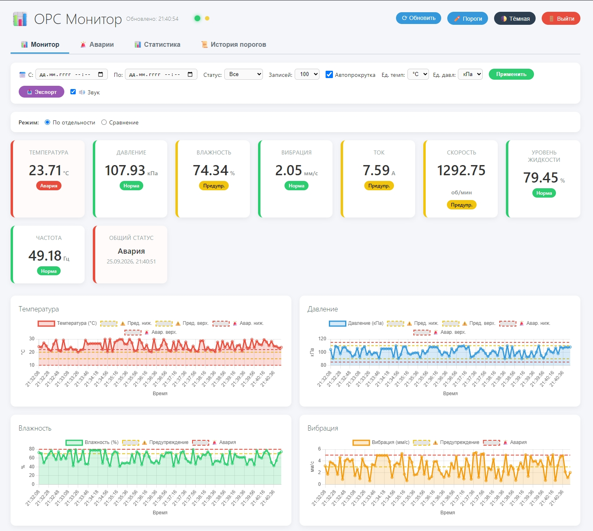
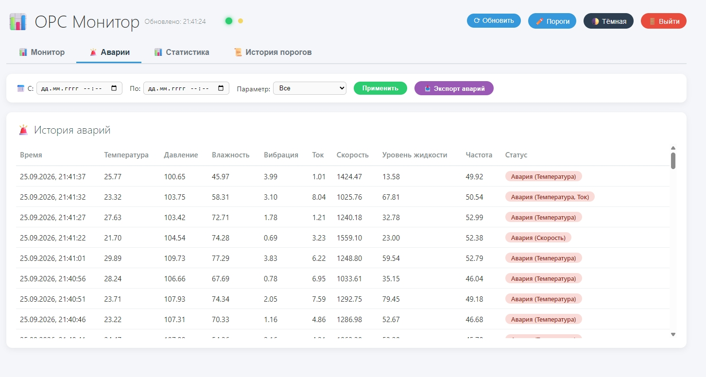
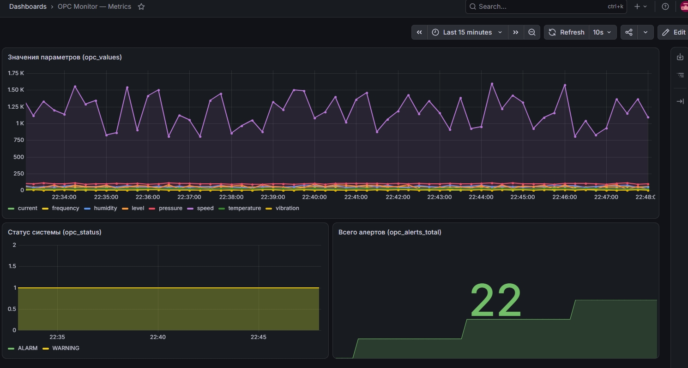
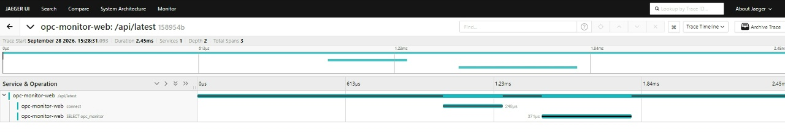
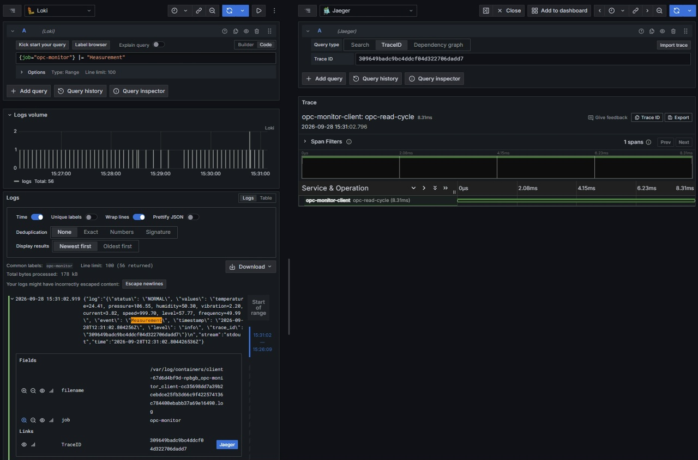
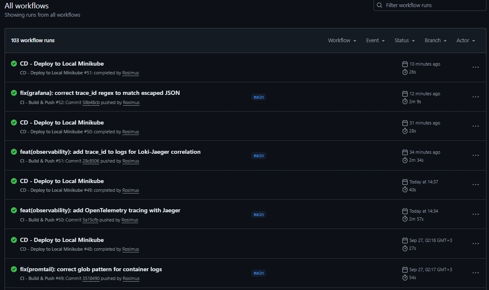
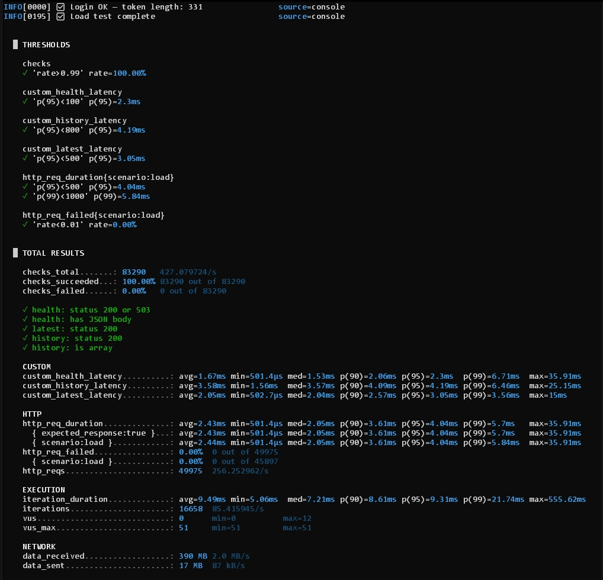

# OPC Monitor

[](https://github.com/Rosimus/opc-monitor/actions/workflows/ci.yml)
[](https://github.com/Rosimus/opc-monitor/actions/workflows/cd.yml)
[](https://github.com/Rosimus/opc-monitor/actions/workflows/codeql.yml)
[](https://codecov.io/gh/Rosimus/opc-monitor)
[](https://github.com/Rosimus/opc-monitor/pkgs/container/opc-monitor)
[](https://www.python.org/downloads/)
[](https://kubernetes.io/)
[](https://helm.sh/)
[](https://argo-cd.readthedocs.io/)
[](#-тестирование)
[](../SECURITY.md)
[](https://opensource.org/licenses/MIT)

**🇬🇧 [English version](../README.md)** | 🇷🇺 Русская версия

> **TL;DR** — Real-time мониторинг промышленного оборудования на OPC UA: 8 параметров, веб-дашборд с графиками и алертами, полный observability-стек (Prometheus + Grafana + Loki + Jaeger), CI/CD через GitHub Actions с self-hosted runner, GitOps через ArgoCD. Python + Flask + PostgreSQL + Redis, 9 контейнеров, 41 тест, 68% unit-coverage, HPA-автоскейлинг web-подов 2–5 реплик в проде, VPA в режиме `Off` для right-sizing, k6 load-tested при 256 RPS с p95 = 4 ms. Развёртывание: Docker Compose для быстрого теста, Helm + Minikube для полного стека, Terraform для Yandex Cloud.

## 📋 Содержание

- [Возможности](#-возможности)
- [Архитектура](#️-архитектура)
- [Стек технологий](#️-стек-технологий)
- [Скриншоты](#-скриншоты)
- [Быстрый старт](#-быстрый-старт)
- [Локальная разработка в Minikube](#-локальная-разработка-в-minikube)
- [CI/CD Pipeline](#-cicd-pipeline)
- [Observability](#-observability)
- [Эксплуатация](#-эксплуатация)
- [Безопасность](#-безопасность)
- [Управление секретами](#-управление-секретами)
- [Тестирование](#-тестирование)
- [Структура проекта](#-структура-проекта)
- [Infrastructure as Code](#️-infrastructure-as-code-terraform)
- [API Endpoints](#-api-endpoints)
- [Architecture Decision Records](#-architecture-decision-records)
- [Roadmap](#️-roadmap)
- [Чему я научился](#-чему-я-научился)
- [Лицензия](#-лицензия)

## ✨ Возможности

### Приложение
- 📊 **Real-time мониторинг** 8 параметров (температура, давление, влажность, вибрация, ток, скорость, уровень, частота)
- 🎬 **Реалистичный симулятор PLC** — random walk, mean reversion, суточные колебания, случайные и каскадные аварии
- 🚨 **Многоуровневые алерты** (Warning / Alarm) с Email и Telegram уведомлениями
- 📈 **Графики в реальном времени** — Chart.js с пороговыми линиями
- 🔐 **JWT-аутентификация** веб-интерфейса
- 📥 **Экспорт данных** в CSV и Excel
- 🎯 **REST API** с автогенерируемой документацией (Swagger)

### Observability
- 📉 **Метрики:** Prometheus + Grafana as code (5 панелей)
- 🔔 **Алерты:** Alertmanager с 4 правилами
- 📋 **Логи:** Loki + Promtail (сбор со всех подов)
- 🔍 **Трейсы:** OpenTelemetry + Jaeger (distributed tracing)
- 🔗 **Корреляция:** `trace_id` в логах и заголовок `X-Trace-Id` в каждом HTTP-ответе + переход Loki ↔ Jaeger одним кликом

### DevOps
- 🐳 **Docker-образ** с multi-stage сборкой и non-root пользователем
- ☸️ **Kubernetes** через kubectl / Helm
- ⛵ **Helm-чарт** с параметризацией под staging/prod
- 🔑 **Управление секретами** через GitHub Secrets + `values-secrets.yaml`
- 🌩️ **Terraform** — IaC для Yandex Cloud (k3s, managed PostgreSQL)
- 🔄 **CI/CD** через GitHub Actions с self-hosted runner
- 🔀 **ArgoCD** — GitOps-подход (pull-модель деплоя)
- ✅ **41 тест** (29 unit + 12 integration) + Codecov, порог покрытия 63%
- 📈 **HPA** — CPU-автоскейлинг web-подов (2–5 реплик в проде)
- 📐 **VPA в режиме `Off`** — рекомендации по right-sizing для всех workload'ов
- ⚡ **k6 load tested** — 256 RPS sustained, p95 = 4 ms, HPA отскейлил 2 → 4
- 📦 **GHCR** — автоматическая загрузка образов
- 🛡️ **Security Hardened** — строгий CSP (без `unsafe-inline` в `script-src`), полный аудит (SAST/SCA/JWT/ZAP/K8s/Docker/Terraform), 0 CVE, 0 находок Bandit/Hadolint/CodeQL

## 🏗️ Архитектура

Проект — это **распределённая система из 9 контейнеров**, объединённых общей сетью и слоем хранения. Каждый сервис выполняет одну функцию.

```
┌──────────────────────────────────────────────────────────┐
│                    OPC UA Server (PLC)                   │
│                    opc.tcp://server:4840                 │
└───────────────────────────┬──────────────────────────────┘
                            │ OPC UA (TCP)
                            ▼
┌──────────────────────────────────────────────────────────┐
│              OPC Client (Python + opcua)                 │
│  • Сбор данных каждые 5 секунд                           │
│  • Проверка порогов                                      │
│  • Отправка алертов (Email, Telegram)                    │
│  • Метрики Prometheus на :8001                           │
│  • OTel трейсы в Jaeger                                  │
└───────────────────────────┬──────────────────────────────┘
                            │ SQLAlchemy + Redis
                            ▼
┌──────────────────────────────────────────────────────────┐
│            PostgreSQL 15 + Redis Cache                   │
└───────────────────────────┬──────────────────────────────┘
                            │
                            ▼
┌──────────────────────────────────────────────────────────┐
│         Web App (Flask + Gunicorn)                       │
│  • REST API с JWT-аутентификацией                        │
│  • Web UI (Chart.js, dark/light тема)                    │
│  • Security headers (Talisman) + Rate limiting           │
│  • Метрики Prometheus на :5000/metrics                   │
│  • OTel трейсы + X-Trace-Id в HTTP-ответах               │
└───────────────────────────┬──────────────────────────────┘
                            │
                            ▼
┌──────────────────────────────────────────────────────────┐
│         Observability Stack                              │
│  • Prometheus + Alertmanager (метрики, алерты)           │
│  • Loki + Promtail (централизованные логи)               │
│  • Jaeger (distributed tracing)                          │
│  • Grafana (единый UI: metrics + logs + traces)          │
└──────────────────────────────────────────────────────────┘
```

## 🛠️ Стек технологий

| Категория | Технологии |
|-----------|------------|
| **Backend** | Python 3.11, Flask, SQLAlchemy, Gunicorn, structlog |
| **Frontend** | Vanilla JS (ES2020), Chart.js, XLSX, jwt-decode — локально в `static/js/`, без CDN |
| **База данных** | PostgreSQL 15, Redis 7 (кэш) |
| **Аутентификация** | JWT (flask-jwt-extended) |
| **Безопасность** | Flask-Talisman (строгий CSP), Flask-Limiter, Trivy, Bandit, Semgrep, Checkov, CodeQL |
| **Оркестрация** | Kubernetes (k3s / Minikube), Helm 3 |
| **GitOps** | ArgoCD |
| **CI/CD** | GitHub Actions, GHCR, self-hosted runner, Dependabot, Codecov |
| **Metrics** | Prometheus, Alertmanager, Grafana |
| **Logs** | Loki, Promtail |
| **Traces** | OpenTelemetry SDK, Jaeger |
| **Load Testing** | k6 (Grafana) |
| **IaC** | Terraform (Yandex Cloud) |
| **Тесты** | pytest, pytest-cov, pytest-mock |
| **DevEx** | Makefile для типовых операций |

## 📸 Скриншоты

### 📊 Real-time Dashboard



*Real-time мониторинг 8 параметров с карточками статусов, графиками и пороговыми линиями*

### 🚨 История аварий



*Полная история аварий с фильтрацией по времени, параметрам и статусу*

### 📈 Grafana — Metrics



*Provisioned дашборд с 5 панелями: значения параметров, статус системы, алерты, RPS и латентность API*

### 🔍 Jaeger — Distributed Tracing



*Waterfall-диаграмма HTTP-запроса `/api/latest`: Flask-обработчик → коннект к БД → SQL-запрос*

### 🔗 Корреляция логов и трейсов



*Split view: слева логи в Loki с trace_id, справа трейс в Jaeger. Переход одним кликом*

### ✅ CI/CD Pipeline



*GitHub Actions: тесты → сборка → Trivy scan → деплой через Helm*

### ⚡ k6 нагрузочное тестирование



*Вывод k6: все пороги зелёные, p95 = 4 ms, 0% ошибок при ~256 RPS*

## 🚀 Быстрый старт

### Предварительные требования

- **Docker Desktop** 4.20+
- **Minikube** 1.30+ (для k8s-развёртывания)
- **kubectl** 1.27+
- **Helm** 3.12+
- **k6** 0.49+ (опционально, для нагрузочного тестирования)
- **make** (опционально, для `make test` и т.п.)

### Три способа запуска

**1. Docker Compose** — самый быстрый, только сервисы без observability:

```bash
git clone https://github.com/Rosimus/opc-monitor.git
cd opc-monitor
cp .env.example .env
docker-compose up -d
# → http://localhost:5000
```

**2. Helm + Minikube** — полный стек, включая Grafana/Jaeger/Loki:

```bash
minikube start --driver=docker --memory=6144 --cpus=4
make build             # docker build -t opc-monitor:latest .
minikube image load opc-monitor:latest
make deploy-local      # helm upgrade --install с values-prod.yaml

kubectl port-forward -n opc-monitor service/web 5000:5000
kubectl port-forward -n opc-monitor service/grafana 3000:3000
kubectl port-forward -n opc-monitor service/jaeger 16686:16686
kubectl port-forward -n opc-monitor service/prometheus 9090:9090
kubectl port-forward -n opc-monitor service/alertmanager 9093:9093
```

**3. ArgoCD GitOps** — pull-модель деплоя (см. [раздел GitOps](#gitops-с-argocd)).

**Доступ:**
- Web UI: http://localhost:5000
- Grafana: http://localhost:3000 (`admin / admin`)
- Jaeger: http://localhost:16686
- Prometheus: http://localhost:9090
- Alertmanager: http://localhost:9093

### Makefile

Все типовые операции — через `make`:

```bash
make help            # список команд
make test            # pytest с coverage
make lint            # bandit + hadolint
make build           # сборка Docker-образа
make deploy-local    # helm upgrade --install в текущий kube-context
make rollback        # helm rollback
make status          # kubectl get pods -n opc-monitor
make logs            # логи web-пода
make hpa             # статус HPA и deployment web
make vpa             # рекомендации VPA
make destroy         # helm uninstall
```

## 🧪 Локальная разработка в Minikube

### ⚠️ Важно: `minikube image load` не перезаписывает образ с тем же тегом

Если собрать образ с тегом `opc-monitor:latest`, загрузить его в Minikube, потом пересобрать с тем же тегом и снова загрузить — **Minikube возьмёт старый образ из кэша**. Это приводит к тому, что под запускается со старым кодом, хотя образ пересобран.

**Решение:** для локальных итераций используем **уникальный тег**:

```bash
TAG="local-$(date +%Y%m%d%H%M%S)"
docker build -t opc-monitor:$TAG .
minikube image load opc-monitor:$TAG

helm upgrade --install opc-monitor ./helm/opc-monitor \
  -n opc-monitor \
  -f ./helm/opc-monitor/values-prod.yaml \
  --set image.repository=opc-monitor \
  --set image.tag=$TAG \
  --set image.pullPolicy=Never \
  --force-conflicts

kubectl rollout status deployment/web -n opc-monitor
```

Флаг `--force-conflicts` нужен, если раньше делали ручной `kubectl set image` — Helm 3.10+ использует server-side apply и отказывается менять поля, ownership которых висит на `kubectl-set`.

### Проверка, что в контейнере новый код

```bash
kubectl exec -n opc-monitor deployment/web -- grep -n "WEBSOCKET" /app/static/js/app.js
```

### Проверка CSP-заголовка

```bash
curl -sI http://localhost:5000/ | grep -i content-security-policy
# Ожидаемо: script-src 'self' (без 'unsafe-inline')
```

### Доступ к observability

В отдельном окне:

```bash
kubectl port-forward -n opc-monitor service/web 5000:5000       # Web UI
kubectl port-forward -n opc-monitor service/grafana 3000:3000   # Grafana
kubectl port-forward -n opc-monitor service/jaeger 16686:16686  # Jaeger UI
```

## 🔄 CI/CD Pipeline

Проект использует **полностью автоматизированный CI/CD** через GitHub Actions.

### CI — Test, Build & Push

При каждом push в `main`:
1. ✅ **Run Tests** — 41 тест (29 unit + 12 integration) + coverage 68%, порог 63%
2. ✅ Загрузка `coverage.xml` в **Codecov**
3. ✅ Сборка Docker-образа
4. ✅ Загрузка в GitHub Container Registry (GHCR)
5. ✅ **Trivy scan** — проверка на уязвимости (CRITICAL/HIGH)
6. ✅ Теги: `latest`, `sha-<commit>`, `<branch>`

### CD — Deploy to Minikube

После успешного CI:
1. ✅ Self-hosted runner получает задачу
2. ✅ Скачивает образ из GHCR
3. ✅ Загружает в Minikube
4. ✅ Выполняет `helm upgrade --install` (атомарно, с `--force-conflicts`)
5. ✅ Подставляет секреты из GitHub Secrets (если заданы)
6. ✅ Проверяет готовность через `kubectl rollout status`

**Время от `git push` до работающего приложения: ~60 секунд** ⚡

### 🤖 Dependabot

Автоматическое обновление зависимостей и SHA-пины GitHub Actions (`.github/dependabot.yml`):

- **github-actions** — еженедельно, пин на commit SHA (защита от supply-chain атак)
- **pip** — Python-пакеты из `requirements.txt`
- **docker** — базовый образ `python:3.11-slim`
- **terraform** — Yandex Cloud provider

Cooldown 7 дней — новые версии не подхватываются сразу, ждём проверки сообществом.

### 🔍 CodeQL

GitHub Advanced Security анализирует Python-код при каждом push и еженедельно:

- SQL injection, XSS, path traversal
- Небезопасная десериализация
- Hardcoded credentials
- Другие CWE-паттерны

Результаты → **Security → Code scanning alerts**.

### GitOps с ArgoCD

ArgoCD отслеживает helm-чарт в Git и синхронизирует его с кластером (pull-модель). CI пушит образ в GHCR, CD обновляет релиз, ArgoCD следит за drift.

**Установка ArgoCD в Minikube:**

```bash
kubectl create namespace argocd
kubectl apply -n argocd -f https://raw.githubusercontent.com/argoproj/argo-cd/stable/manifests/install.yaml

# Пароль admin
kubectl -n argocd get secret argocd-initial-admin-secret -o jsonpath="{.data.password}" | base64 -d

# Проброс портов
kubectl port-forward svc/argocd-server -n argocd 8080:443
```

**Application манифест** — `argocd/application.yaml`.

### Откат

```bash
# Через Helm
helm history opc-monitor -n opc-monitor
helm rollback opc-monitor -n opc-monitor

# Через ArgoCD UI
# Открыть приложение → History and Rollback → выбрать ревизию
```

## 🔍 Observability

### Метрики (Prometheus + Grafana)

- **Prometheus** собирает метрики с web и client (`/metrics`)
- **Grafana** показывает 5 панелей: значения параметров, статус, счётчик алертов, RPS, латентность API
- Дашборд провизионится как код через ConfigMap

### Логи (Loki + Promtail)

- **Promtail** собирает логи со всех подов через `/var/log/containers/`
- **Loki** хранит логи 7 дней
- **Grafana Explore → Loki** — поиск по логам

### Трейсы (OpenTelemetry + Jaeger)

- **OTel SDK** инструментирует Flask, SQLAlchemy, requests
- **Jaeger** принимает трейсы через OTLP (gRPC)
- Каждый запрос оставляет трейс со спанами (HTTP → SQL → Redis)
- **Каждый HTTP-ответ содержит заголовок `X-Trace-Id`** — 32-символьный hex-идентификатор текущего span. Это позволяет клиенту (или внешней системе) мгновенно найти нужный трейс в Jaeger по ID из ответа, без ручного поиска.

Проверка:

```bash
curl -sI http://localhost:5000/health | grep -i x-trace-id
# X-Trace-Id: 4bf92f3577b34da6a3ce929d0e0e4736
```

### Корреляция logs ↔ traces

Каждая запись лога содержит `trace_id`. В Grafana:

1. **Explore → Loki** → запрос `{job="opc-monitor"} |= "Measurement"`.
2. Раскрой лог → поле **TraceID** → клик → откроется трейс в Jaeger.
3. Из Jaeger → **Logs** → переход обратно в Loki по времени спана.

### Алерты (Alertmanager)

4 правила в `monitoring/alerts.yml`:

| Алерт | Severity | Условие |
|-------|----------|---------|
| `ServiceDown` | critical | Сервис недоступен > 1 мин |
| `HighAlarmRate` | warning | > 0.5 алертов/сек за 5 мин |
| `NoMeasurements` | warning | Нет измерений > 3 мин |
| `HighAPILatency` | warning | p95 API > 1 сек за 3 мин |

## 🚀 Эксплуатация

### Runbook

Инструкция для on-call инженера: диагностика алертов, типовые операции, восстановление после сбоев — в **[RUNBOOK.md](RUNBOOK.md)**.

### SLO / SLI

| Метрика | SLI | SLO |
|---------|-----|-----|
| Доступность Web UI | `up{job="opc-monitor"}` | ≥ 99% в месяц |
| Доступность OPC Client | `up{job="opc-client"}` | ≥ 99% в месяц |
| Латентность API (p95) | `histogram_quantile(0.95, api_latency_seconds_bucket)` | < 500 ms |
| Задержка сбора данных | `rate(opc_values[5m])` | > 0 |
| RTO | — | ≤ 5 минут (helm rollback) |
| RPO | — | ≤ 24 часа (pg_dump) |

**Error Budget:** 1% недоступности в месяц = ~7.2 часа.

### Типовые операции

```bash
make status                                        # kubectl get pods -n opc-monitor
make logs                                          # логи web-пода
make hpa                                           # статус HPA
make vpa                                           # рекомендации VPA
make rollback                                      # helm rollback
kubectl rollout restart deployment/web -n opc-monitor
```

Полный список — в **[RUNBOOK.md](RUNBOOK.md)**.

### Right-sizing ресурсов (VPA)

В проекте **VPA работает в режиме `Off`** для всех workload'ов. Он собирает статистику использования ресурсов и выдаёт рекомендации, но **никогда не трогает работающие поды**. Это исключает конфликты с HPA (web-tier) и рискованные рестарты stateful-сервисов (Postgres, Prometheus, Loki, Grafana, Jaeger).

Через 24 часа работы VPA показал значительный over-provisioning:

| Workload | Текущий `requests.cpu` | Рекомендация VPA | Экономия |
|----------|-----------------------|------------------|----------|
| web | 200m | 126m | −37% |
| client | 200m | 49m | −75% |
| server | 100m | 35m | −65% |
| prometheus | 200m | 100m | −50% |
| grafana | 100m | 50m | −50% |
| alertmanager | 50m | 30m | −40% |

Рекомендации применяются вручную через PR в `values.yaml` — так `hpa.targetCPU` остаётся синхронным с `requests`.

Проверка рекомендаций:

```bash
make vpa
kubectl describe vpa web-vpa -n opc-monitor
```

### Нагрузочное тестирование

Нагрузочный тест проведён с помощью **k6** при стабильных ~256 RPS.

**Профиль теста:** ramp-up 30s → 100 iters/s на 2 минуты → ramp-down 30s. Четыре эндпоинта: `/health`, `/api/latest`, `/api/history`, `/metrics`.

**Результат после оптимизации:**

| Метрика | До | После |
|---------|-----|-------|
| p95 latency | 700 ms | **4.0 ms** |
| p99 latency | 880 ms | 5.8 ms |
| Error rate | 0.00% | 0.00% |
| Пропускная способность | 250 RPS | 256 RPS |
| Реплик HPA | 2 | **4** |

**Изначальная конфигурация** (2 Gunicorn-воркера, лимит 500m CPU) упиралась в p95 = 700 ms. После увеличения до **4 воркеров** и **1000m CPU** p95 упал **в 175 раз**, а HPA отскейлил web-tier с 2 до 4 реплик.


Скрипт теста: [`tests/load/k6-test.js`](../../tests/load/k6-test.js).

Локальный запуск:

```bash
kubectl port-forward -n opc-monitor service/web 5000:5000
k6 run tests/load/k6-test.js
```

Rate-лимиты настраиваются через env-переменную `RATELIMIT_DEFAULT` (по умолчанию `1000 per hour, 200 per minute`). Для нагрузочного теста переопределить через `--set web.ratelimitDefault="100000 per minute"`.

## 🔐 Безопасность

Полный отчёт аудита и список принятых рисков — в **[SECURITY.md](../SECURITY.md)**.

### Уровень приложения

- ✅ **JWT-аутентификация** — flask-jwt-extended, HS256, access-token 60 мин
- ✅ **Timing-safe сравнение паролей** — `secrets.compare_digest`
- ✅ **Rate limiting** — Redis-based, `/health` и `/metrics` исключены из лимитов, настраивается через `RATELIMIT_DEFAULT`
- ✅ **Security Headers** — Flask-Talisman (CSP, HSTS, X-Frame-Options, X-Content-Type-Options, COOP, COEP, Permissions-Policy)
- ✅ **Строгий CSP** — `script-src 'self'` без `'unsafe-inline'`. Все inline-обработчики (`onclick=`) заменены на `data-action` + event delegation в `static/js/app.js`. `style-src` оставляет `'unsafe-inline'` — Chart.js и JS применяют inline-стили динамически; риск XSS через style-src существенно ниже.
- ✅ **Локальные библиотеки** — Chart.js, XLSX, jwt-decode вынесены из CDN в `static/js/`
- ✅ **Параметризованные SQL-запросы** — SQLAlchemy ORM

### Уровень контейнера и Kubernetes

- ✅ **Non-root user** — `USER 1000:1000`, числовой UID
- ✅ **securityContext** — `runAsNonRoot`, `allowPrivilegeEscalation: false`, `capabilities.drop: [ALL]`, `seccompProfile: RuntimeDefault`
- ✅ **readOnlyRootFilesystem** для web, client, server + emptyDir для `/tmp`
- ✅ **NetworkPolicy** — default-deny ingress, разрешён только internal + web:5000
- ✅ **PodDisruptionBudget** — minAvailable: 1 для web
- ✅ **ServiceAccount** `opc-app` с `automountServiceAccountToken: false`
- ✅ **initContainer** `wait-for-postgres` — устраняет race condition при рестарте
- ✅ **Resource limits** — CPU, memory, ephemeral-storage для всех контейнеров

### Уровень БД

- ✅ **opc_user — NOT superuser** (NOSUPERUSER NOCREATEROLE NOCREATEDB)
- ✅ **Минимальные привилегии** — CRUD без TRUNCATE/REFERENCES/TRIGGER
- ✅ **init-скрипт** понижает права при первичной инициализации

### Уровень CI/CD

- ✅ **Bandit** — SAST, 0 находок
- ✅ **pip-audit** — SCA, 0 CVE
- ✅ **Semgrep** — SAST (p/python, p/flask, p/owasp-top-ten)
- ✅ **CodeQL** — Python SAST (GitHub Advanced Security)
- ✅ **Trivy** — образ: 0 CVE; Terraform config scan
- ✅ **Hadolint** — Dockerfile: 0 WARN
- ✅ **Checkov** — Kubernetes, Helm, Terraform
- ✅ **kube-score** / **kubesec** — анализ манифестов
- ✅ **Dependabot** — обновление зависимостей и SHA-пины actions

### Соответствие стандартам

- ✅ **OWASP Top 10** — A01, A02, A03, A05, A07
- ✅ **CIS Docker Benchmark** — non-root user, healthcheck
- ✅ **CIS Kubernetes Benchmark** — securityContext, resource limits, NetworkPolicy

### 📊 Сводка сканеров

| Сканер | Что проверяет | Результат |
|--------|---------------|-----------|
| **Bandit** | Python SAST | ✅ 0 находок |
| **pip-audit** | Зависимости (CVE) | ✅ 0 CVE |
| **Semgrep** | Python + OWASP Top 10 | ✅ 0 находок |
| **CodeQL** | Python SAST (GitHub) | ✅ 0 alerts |
| **Trivy image** | Docker-образ | ✅ 0 CVE (CRITICAL/HIGH) |
| **Hadolint** | Dockerfile | ✅ 0 WARN |
| **kube-score** | K8s манифесты | ⚠️ ~24 CRITICAL (приняты) |
| **kubesec** | K8s поды | 🟡 9/10 (web), 7/10 (client, server) |
| **Checkov** | K8s + Helm + Terraform | ⚠️ 967 Passed / 48 Failed (приняты) |
| **OWASP ZAP** | Web API | ✅ 0 FAIL, 4 WARN (не-уязвимости) |
| **jwt_tool** | JWT alg:none | ✅ Устойчив |

### Про «приняты» — что это значит

Некоторые сканеры (kube-score, Checkov) выдали срабатывания, которые **осознанно приняты** для этого проекта. Это не «мы не стали чинить», а «мы посмотрели и решили, что для нашего контекста риск приемлемый». Примеры:

- **kube-score CRITICAL** — большая часть про отсутствие `readinessProbe`/`livenessProbe` у observability-сервисов (Loki, Promtail, Grafana). Для homelab допустимо — сервисы не критичны для основной функции.
- **Checkov Failed** — про хранение `postgresPassword` в values (в проде — через External Secrets Operator), про отсутствие `NetworkPolicy` на некоторых сервисах, про отсутствие pod security policies.

Полное обоснование по каждому пункту — в **[SECURITY.md](../SECURITY.md)**. В проде каждый из этих пунктов закрывается: ESO для секретов, default-deny NetworkPolicy для всего namespace, OPA/Gatekeeper для policy-as-code.

## 🔑 Управление секретами

### Для Helm-деплоя (прод)

Секреты хранятся в **`helm/opc-monitor/values-secrets.yaml`** — файл в `.gitignore`, не попадает в репозиторий.

```bash
cp helm/opc-monitor/values-secrets.yaml.example helm/opc-monitor/values-secrets.yaml
# Заполнить реальными значениями:
#   jwtSecretKey     — python -c "import secrets; print(secrets.token_hex(32))"
#   postgresPassword — пароль БД
#   adminPassword    — пароль admin в web UI
#   grafanaPassword  — пароль Grafana
```

Деплой:

```bash
helm upgrade --install opc-monitor ./helm/opc-monitor \
  --namespace opc-monitor \
  --values ./helm/opc-monitor/values-prod.yaml \
  --values ./helm/opc-monitor/values-secrets.yaml
```

### Для CI/CD (GitHub Actions)

Секреты хранятся в **GitHub Secrets** и пробрасываются в `cd.yml`:

| Secret | Назначение |
|--------|-----------|
| `JWT_SECRET_KEY` | Подпись JWT-токенов (64 hex) |
| `POSTGRES_PASSWORD` | Пароль PostgreSQL |
| `ADMIN_PASSWORD` | Пароль admin в web UI |
| `GRAFANA_PASSWORD` | Пароль Grafana |
| `CODECOV_TOKEN` | Токен для загрузки покрытия в Codecov |

Настроить: **Settings → Secrets and variables → Actions → New repository secret**.

### Для локальной разработки

Через `.env` (см. `.env.example`) для Docker Compose.

### Что НЕ должно попадать в репо

- `helm/opc-monitor/values-secrets.yaml` — в `.gitignore`
- `.env`, `.env.*` — в `.gitignore`
- `terraform/terraform.tfvars` — в `.gitignore`
- `security-audit/` — в `.gitignore`
- `coverage.xml`, `.coverage` — в `.gitignore`

### Продакшен-подходы

| Инструмент | Как работает |
|------------|--------------|
| **External Secrets Operator** | Синхронизирует секреты из Vault / Yandex Lockbox / AWS Secrets Manager |
| **Sealed Secrets** | Секреты шифруются публичным ключом и коммитятся в Git |
| **SOPS + age/KMS** | Шифрование файлов values; расшифровка при деплое |
| **HashiCorp Vault + Agent Injector** | Секреты инжектятся в поды напрямую из Vault |

## 🧪 Тестирование

```bash
make test                    # pytest + coverage + порог 63%
make test-fast               # без coverage, быстрее
```

**41 тест** покрывают:

### Unit-тесты (`tests/test_utils.py`)
- `get_param_status` — двусторонний и односторонний контроль, edge cases
- `parse_datetime` — 5 сценариев парсинга
- Конвертеры температуры и давления
- Лейблы единиц измерения

### Integration-тесты (`tests/test_api.py`)
- Healthcheck (`/health`)
- Авторизация (`/api/auth/login`) — успех и провал
- JWT-защита (`/api/latest`, `/api/history`, `/api/params`)
- Metrics (`/metrics`)
- Root (`/`)

### Покрытие

**~68%** (branch coverage, только код, предназначенный для unit-тестов).

Из подсчёта **исключены**:
- `client.py`, `server.py` — отдельные сервисы, тестируются интеграционно
- `db.py` — SQLAlchemy-слой, требует реальной БД
- `tracing.py` — инициализация OTel с побочными эффектами
- `*/tests/*`, `*/__pycache__/*`, `conftest.py`

Конфиг — в `.coveragerc`. Порог `--cov-fail-under=63` в CI (запас 5 п.п. от фактического).

Бейдж покрытия — [Codecov](https://codecov.io/gh/Rosimus/opc-monitor).

## 📁 Структура проекта

```
opc-monitor/
├── .github/
│   ├── workflows/
│   │   ├── ci.yml               # tests + coverage + build + Trivy + push
│   │   ├── cd.yml               # deploy через Helm (--force-conflicts)
│   │   └── codeql.yml           # SAST (GitHub Advanced Security)
│   └── dependabot.yml           # auto-update deps + SHA-pins
├── argocd/
│   └── application.yaml         # ArgoCD Application (GitOps)
├── docs/
│   ├── README.ru.md             # этот файл — русская версия
│   ├── RUNBOOK.md
│   ├── adr/                     # Architecture Decision Records
│   │   ├── 0001-flask-vs-fastapi.md
│   │   ├── 0001-flask-vs-fastapi.ru.md
│   │   ├── 0002-loki-vs-elk.md
│   │   ├── 0002-loki-vs-elk.ru.md
│   │   ├── 0003-k3s-vs-kind.md
│   │   ├── 0003-k3s-vs-kind.ru.md
│   │   ├── 0004-self-hosted-runner.md
│   │   └── 0004-self-hosted-runner.ru.md
│   └── screenshots/
├── helm/opc-monitor/            # Helm-чарт
│   ├── Chart.yaml
│   ├── values.yaml
│   ├── values-staging.yaml
│   ├── values-prod.yaml
│   ├── values-secrets.yaml.example
│   ├── dashboards/
│   │   └── opc-monitor.json
│   └── templates/
│       ├── hpa.yaml             # HorizontalPodAutoscaler для web
│       ├── vpa.yaml             # VerticalPodAutoscaler для всех workload'ов
│       └── ...
├── k8s/                         # Kubernetes-манифесты (kubectl)
├── monitoring/
│   ├── prometheus.yml
│   ├── alerts.yml
│   ├── alertmanager.yml
│   ├── loki-config.yml
│   ├── promtail-config.yml
│   ├── grafana-datasources.yml
│   ├── grafana-dashboards.yml
│   └── grafana-dashboard.json
├── terraform/                   # IaC для Yandex Cloud
├── tests/
│   ├── __init__.py
│   ├── conftest.py
│   ├── test_utils.py
│   ├── test_api.py
│   └── load/
│       └── k6-test.js           # k6 load test (256 RPS, p95 = 4 ms)
├── static/js/                   # локальные библиотеки (были в CDN)
│   ├── app.js                   # + event delegation для CSP
│   ├── chart.umd.min.js
│   ├── jwt-decode.min.js
│   ├── socket.io.min.js         # не подключён, оставлен на будущее
│   └── xlsx.full.min.js
├── templates/index.html
├── client.py                    # OPC UA клиент
├── server.py                    # OPC UA симулятор (PLCSimulator)
├── web_app.py                   # Flask приложение
├── db.py                        # SQLAlchemy + Redis
├── tracing.py                   # OpenTelemetry инициализация
├── utils.py
├── config.yaml
├── Dockerfile
├── docker-compose.yml
├── requirements.txt
├── pytest.ini
├── .coveragerc                  # конфиг coverage.py
├── Makefile                     # типовые операции
├── .bandit                      # конфиг Bandit
├── SECURITY.md                  # отчёт аудита и принятые риски
└── README.md
```

## 🌩️ Infrastructure as Code (Terraform)

Полная Terraform-конфигурация для развёртывания в Yandex Cloud:

| Ресурс | Описание |
|--------|----------|
| **VPC Network** | Сеть с публичной и приватными подсетями |
| **NAT Gateway** | Интернет-доступ для приватных подсетей |
| **Security Group** | SSH по IP владельца, k3s API/VXLAN/kubelet — internal |
| **k3s Master** | VM с k3s control-plane |
| **k3s Workers ×2** | VM с k3s агентами в разных зонах |
| **Managed PostgreSQL** | Кластер БД (s2.micro, 20 GB SSD) |

```bash
cd terraform
cp terraform.tfvars.example terraform.tfvars
terraform init && terraform validate && terraform plan
terraform apply     # создаст платные ресурсы
terraform destroy   # удалит
```

**Стоимость:** ~1 200 ₽/мес при работе 24/7 (3× preemptible VM + managed PostgreSQL s2.micro). После демо — `terraform destroy`.

## 📊 API Endpoints

| Метод | Endpoint | Описание | Rate Limit |
|-------|----------|----------|------------|
| `POST` | `/api/auth/login` | Получить JWT-токен | 5/min |
| `POST` | `/api/auth/refresh` | Обновить токен | 200/min |
| `GET` | `/api/params` | Список параметров | 200/min |
| `GET` | `/api/latest` | Последнее измерение | 200/min |
| `GET` | `/api/history` | История измерений | 200/min |
| `GET` | `/api/alarms` | История аварий | 200/min |
| `GET` | `/api/stats` | Статистика | 200/min |
| `GET` | `/api/thresholds` | Текущие пороги | 200/min |
| `POST` | `/api/thresholds/update` | Обновить пороги | 200/min |
| `GET` | `/api/export` | Экспорт данных (CSV) | 200/min |
| `GET` | `/health` | Health check | — |
| `GET` | `/metrics` | Prometheus метрики | — |

Полная документация: http://localhost:5000/api/docs

## 📚 Architecture Decision Records

Ключевые технические решения задокументированы как ADR — короткие заметки с контекстом, решением и последствиями. Это помогает будущему читателю (и мне самому через полгода) понять, почему выбрано именно так.

- [ADR-0001: Flask vs FastAPI](adr/0001-flask-vs-fastapi.ru.md)
- [ADR-0002: Loki + Promtail vs ELK Stack](adr/0002-loki-vs-elk.ru.md)
- [ADR-0003: k3s vs kind для локального кластера](adr/0003-k3s-vs-kind.ru.md)
- [ADR-0004: Self-hosted runner vs GitHub-hosted](adr/0004-self-hosted-runner.ru.md)

## 🗺️ Roadmap

Планы по развитию проекта:

### Безопасность
- [ ] **CSP без `'unsafe-inline'` в `style-src`** — вынос inline-стилей в CSS-классы
- [ ] **OPA/Gatekeeper** — policy-as-code для манифестов (запрет `:latest`, обязательные labels)
- [ ] **External Secrets Operator** — синхронизация секретов из Vault / Yandex Lockbox
- [x] **a11y: связка label ↔ input** — устранить warnings Chrome DevTools (Issues)

### Надёжность
- [x] **VPA** в режиме `Off` — рекомендации по requests/limits
- [x] **k6 load testing** — 256 RPS, p95 = 4 ms, HPA отскейлил 2→4
- [ ] **Integration-тесты БД** — покрытие `db.py` на in-memory SQLite

### DevOps
- [ ] **Multi-cluster ArgoCD** через ApplicationSet — staging + prod в одном UI
- [ ] **GitHub Actions: OIDC** вместо долгоживущих токенов
- [ ] **Trivy SBOM** — генерация и публикация Software Bill of Materials

### Документация
- [x] **English ADR translations** — перевод ADR на английский
- [ ] **GIF с asciinema** — визуализация `terraform plan` и деплоя

## 🎓 Чему я научился

- **GitOps ≠ «деплой через CI».** ArgoCD вытягивает состояние из Git, CI только пушит образ. Поначалу смешивал эти роли.
- **Observability — это связка, а не три отдельных инструмента.** Корреляция logs ↔ traces через `trace_id` даёт больше, чем каждый стек по отдельности. Именно поэтому добавил `X-Trace-Id` в заголовки HTTP-ответов.
- **Self-hosted runner — компромисс.** Бесплатно и быстро для homelab, но секьюрность и uptime — на тебе.
- **«0 CVE» — это процесс, а не разовая проверка.** Dependabot + SHA-пины + cooldown 7 дней важнее, чем текущий результат сканера.
- **Coverage — не самоцель.** Сначала исключил из подсчёта то, что не предназначено для unit-тестов (`client.py`, `server.py`, `db.py`), потом стал смотреть на цифру. Порог `--cov-fail-under` поставил с запасом — чтобы CI не падал от случайного рефакторинга.
- **`minikube image load` не перезаписывает образ с тем же тегом.** Один из самых коварных моментов при локальной разработке в Minikube — используем уникальный тег для каждой сборки.
- **HPA и `replicas` конфликтуют.** HPA пишет в `.spec.replicas`; если Helm на каждом upgrade тоже задаёт `replicas`, поды «дёргаются». Починили условием в чарте: `{{- if not .Values.web.hpa.enabled }}`.
- **VPA в `Off` режиме — этого достаточно.** Рекомендации полезны и без автоматической мутации: получаешь data-driven right-sizing без риска рестартов подов и без поломки HPA-скейлинга по CPU.
- **Нагрузочное тестирование вскрывает недостатки тюнинга.** Изначальная конфигурация web (2 Gunicorn-воркера, 500m CPU) упиралась в p95 = 700 ms при 250 RPS. После перехода на 4 воркера + 1000m CPU p95 упал до **4 ms** — улучшение в 175 раз — и HPA отскейлил tier с 2 до 4 реплик.

## 📝 Лицензия

MIT. См. [LICENSE](../LICENSE).

## 👤 Автор

**Rosimus**

- GitHub: [@Rosimus](https://github.com/Rosimus)
- Email: rosimus854@gmail.com

---

⭐ Если проект был полезен — поставьте звезду!